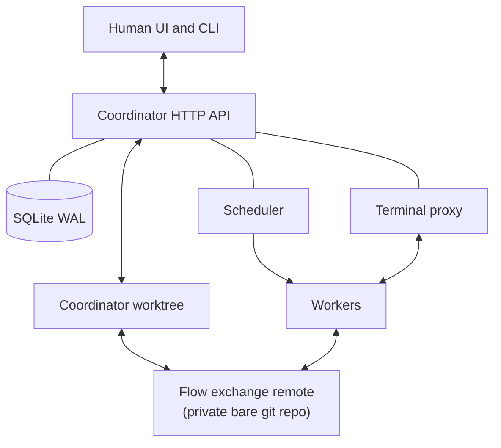

# Flow Design

Flow is a local-first, single-person agentic development workflow system. It is
not a GitHub clone with agents added on. It is a control plane for coordinating
many agent environments while the human acts as architect, reviewer, and TPM.

This document turns the design draft into an implementation-ready design. It
also records the details that needed to be decided before development could
begin.

## Pre-Development Decisions

The draft was architecturally coherent, but several build-spec details were
missing or internally ambiguous. These decisions resolve the blockers:

1. SQLite is durable enough for the local use case, without HA.
   The draft treated SQLite as deliberately losable. Flow will instead treat it
   as the primary local operational store: durable on disk, WAL-backed, and
   expected to survive normal restarts and crashes. The initial design does not
   include replication, failover, or high-availability machinery.

2. Handoffs are coordinator-owned data, not committed files.
   The handoff is submitted to the coordinator at `flow ready` (and optionally
   mid-session via `flow handoff write`) and stored in SQLite as a per-change
   snapshot. It is never committed to the repo, so merges need no handoff
   exclusion, and the next session receives the prior handoff injected into its
   prompt. Flow's merge still omits `.flow/session/**` from the squash commit.

3. The first implementation targets one Go module with three binaries.
   `flow` is the safe client CLI for humans and in-session agents.
   `flow-server` runs the coordinator, bundled web UI, admin setup, and git
   hook entrypoints. `flow-worker` is the worker supervisor. Exact dependency
   versions are pinned when code is scaffolded.

4. The MVP targets local and tailnet workers, not public multi-tenant hosting.
   Multi-user permissions, organizations, public auth flows, GitHub pull-down
   sync, and release/deploy workflows are out of scope.

5. The initial harness order is Codex first, then Claude Code.
   opencode support remains deferred. The watchdog is still implemented in the
   MVP because harness hook support can vary and because missed waiting signals
   would leak hot worker slots.

6. Author completion is explicit.
   An author session becomes reviewable only when the session invokes
   `flow ready`. Harness idle/stop hooks only mean "the agent yielded the turn,"
   never "the work is done."

7. Issues live in SQLite, not as repo artifacts.
   Issue state is coordinator-owned application data. Workers and humans create
   and read issues through the API, which allocates issue IDs transactionally.
   This avoids git merge conflicts and ID collisions when multiple workers
   discover new work concurrently.

8. SQLite migrations are allowed, but pre-1.0 compatibility is not a goal.
   The repository instruction says not to assume backward compatibility unless
   explicitly stated. During early development, destructive migration/reset is
   acceptable for developer builds when it speeds the design.

9. The Flow exchange remote is a first-class component.
   Workers need a shared git rendezvous. Flow therefore owns a private bare git
   remote, named `flow` by default, that workers clone/fetch/push from.
   Existing remotes such as `origin` are left for the user to push manually.

With those decisions made, there are no blocking product-design questions before
beginning development. Later choices, such as cloud autoscaling and automated
downstream mirror pushes, are intentionally outside the first build.

## Goals

- Coordinate personal agentic development across multiple hot or ephemeral
  environments.
- Surface only the human's turn states: mid-session feedback and final merge
  acceptance.
- Keep code, handoff documents, check configuration, and trailers in git.
- Keep operational state fast, queryable, and durable enough in local SQLite.
- Make CI, reviewer agents, verifier agents, and author agents variants of one
  job model.
- Provide a board, diff/review view, and terminal attach surface.
- Merge completed work into Flow's exchange remote.

## Non-Goals

- Multi-person permissions, organizations, teams, or shared issue ownership.
- GitHub-as-peer synchronization or syncing comments/issues with external
  systems.
- General DAG workflow orchestration.
- Kubernetes-first design. Kubernetes can be a later worker provider.
- Public SaaS hosting.
- Release workflows such as npm publishing. Those remain repo-specific.
- SQLite replication, failover, or HA design.
- Backward-compatible migrations during the early implementation.

## System Overview

Flow has four planes:

- Coordinator: owns HTTP API, SQLite, the in-process lifecycle workflow engine,
  scheduler, derived board views, terminal reverse proxy, and merge actions.
- Worker pool: environments that advertise capabilities, claim jobs, run
  entrypoints in tmux, heartbeat leases, and report events.
- Git: a coordinator worktree plus a private Flow exchange remote containing
  code, branch handoff documents, check configuration, and `Resolves:` trailers.
- Human UI/CLI: board, diff/review, issue editing, scheduling, merge, and
  terminal attach.



## Technology Choices

The initial repository should be a Go monorepo:

- `cmd/flow`: client CLI for human and in-session commands.
- `cmd/flow-server`: coordinator daemon, admin setup, and git hook entrypoints.
- `cmd/flow-worker`: worker supervisor and tmux/job execution.
- `internal/api`: HTTP handlers, auth, request/response types. Lifecycle
  handlers authenticate, build a typed event, and call the engine.
- `internal/client`: client command plumbing and API client.
- `internal/coordinator`: single-step domain services (issues, sessions, checks,
  merges, reviews), the explicit `phase` projection, and the transition-log
  read model.
- `internal/lifecycle`: the in-process workflow engine. It owns the canonical
  issue transition table, the `Step` entry point, guards and actions, the
  durable transition log, and the timer/recovery loop.
- `internal/db`: SQLite schema, views, transactions, and embedded migrations.
- `internal/scheduler`: selector/taint matching and queue selection.
- `internal/worker`: worker registration, claim loop, heartbeat, release.
- `internal/worker/execution`: checkout, tmux execution, entrypoint supervision.
- `internal/harness`: Claude Code and Codex hook/watchdog integrations.
- `internal/git`: exchange remote, server hooks, branch, trailer, diff, and
  squash-merge helpers.
- `internal/terminal`: ttyd/reverse-proxy integration.
- `web`: dependency-light browser UI, built and served by the coordinator.
  It uses browser-native custom elements, a small TypeScript codebase for API
  types and component logic, and CSS Modules for scoped styling. The MVP should
  not use React, Vue, Svelte, a runtime component framework, a client state
  manager, or a general UI kit.

SQLite is the database. The coordinator is the single writer. The API is
HTTP/JSON, versioned with a `Flow-Protocol-Version` header. The UI may poll in
the first version; server-sent events can be added when useful.

## Existing Repository Onboarding

Adopting an existing repository should not require restructuring the repository
or replacing its current remote. Flow adds local application state and a private
exchange remote.

Happy path:

```text
mkdir -p .flow-local
openssl rand -hex 32 > .flow-local/owner.token
openssl rand -hex 32 > .flow-local/worker-join.token
chmod 600 .flow-local/owner.token
chmod 600 .flow-local/worker-join.token
flow-server serve --data-dir ~/.local/share/flow \
  --owner-token-file .flow-local/owner.token \
  --worker-join-token-file .flow-local/worker-join.token
cp examples/flow-worker.yaml .flow-local/worker.yaml
FLOW_WORKER_JOIN_TOKEN="$(tr -d '\r\n' < .flow-local/worker-join.token)" flow-worker -c .flow-local/worker.yaml
cd /path/to/existing/repo
git status
flow init --repo .
flow issue create
flow issue schedule i-0001 up_next
```

`flow init` does not seed role-skill files into the repository. Flow role
instructions are maintained as flat markdown files in the Flow source tree and
compiled into the `flow` binary for prompt generation.

`flow init` (run against the already-running `flow-server`) does the following:

1. Verifies `--repo` is an existing git worktree with at least one commit.
2. Detects or validates the base branch.
3. Creates a Flow project record and SQLite database in Flow's local data
   directory.
4. Creates a private bare exchange remote, normally in Flow's local data
   directory.
5. Adds that remote to the worktree as `flow`, unless a different name is
   supplied.
6. Seeds the exchange remote by pushing only the configured base branch.
7. Installs exchange-remote hooks.
8. Records owner, hook, and coordinator git credentials.
9. Leaves all existing remotes, including `origin`, untouched.
10. Writes a client config so later CLI commands need no `--server`/`--token`.

One global worker config serves every project. `flow-server serve` does not
create it; operators start from `examples/flow-worker.yaml` or another
deployment-specific config, and `flow-worker` joins the server with
`FLOW_WORKER_JOIN_TOKEN` when the config does not contain a worker token.
Project registration does not create a per-project worker config.

Default behavior is deliberately conservative:

- Existing `origin` is not renamed, removed, or used as the active Flow remote.
- Existing feature branches are not imported as Flow issue branches.
- Dirty working tree changes are not included in the exchange remote seed.
- No downstream push happens during initialization.
- No committed file is written unless the user asks Flow to create starter
  check configuration.

Useful options:

```text
flow init --repo . --base main
flow init --repo . --base main --exchange-name flow-local
flow init --repo . --base main --name my-project
flow init --repo . --base main --server http://127.0.0.1:8421 --token "$OWNER_TOKEN"
```

Existing remotes such as `origin` remain available for manual user pushes.
Flow does not configure or run downstream mirror pushes in the MVP.


Registration seeds the exchange remote from committed `HEAD`. If the worktree
has uncommitted local changes, Flow still seeds from `HEAD` and prints a warning
that those changes were not included.

If a `flow` remote already exists, init fails with a clear message unless
`--exchange-name` or `--exchange-url` specifies how to reuse or replace it.

The command is idempotent after successful initialization. Re-running it verifies
the project registration, database, exchange remote, configured base branch, and
hooks instead of creating a second Flow project.

## Git Topology and Remote Roles

Flow cares about the active workflow remote. Existing provider remotes such as
GitHub or Codeberg are not part of Flow's active workflow in the MVP; users may
push to them manually outside Flow.

There are two Flow-managed git roles:

1. Coordinator worktree.
   The repository Flow is managing. The coordinator performs squash merges and
   pushes authoritative base-branch updates here. Issue state is not edited in
   the worktree.

2. Flow exchange remote.
   A private bare git repository, remote name `flow` by default. Workers clone,
   fetch, and push issue branches through this remote. It is the git rendezvous
   point for active work and must support server-side hooks. For all-local use,
   this can be a `file://` remote in Flow's data directory. For remote workers,
   it can be served over SSH on a tailnet.

Default configuration shape:

```yaml
git:
  base_branch: main
  exchange:
    name: flow
    url: file:///Users/me/.local/share/flow/projects/p-123/exchange.git
    hooks: required
```

The exchange remote is provider-agnostic only within limits. It must allow:

- private WIP branches
- worker fetch/push access
- coordinator base-branch push access
- server-side hooks
- ordinary git protocol access from every worker class

That means a generic hosted forge is not the Flow exchange remote in the MVP. A
self-hosted bare repo with hooks can be the exchange remote.

### Exchange Refs

Flow uses these refs in the exchange remote:

- `refs/heads/<base>`: protected base branch, normally `main`.
- `refs/heads/issue/<issue-id>`: active issue branch.
- `refs/tags/*`: release tags when explicitly pushed by the coordinator.
- future `refs/flow/*`: internal scratch or archival refs.

Issue branch names remain the universal join key. The exchange remote makes that
join key available across machines.

### Server-Side Hooks

Flow installs hooks in the exchange remote. Hooks are guardrails and event
sources; they are not the workflow engine.

`pre-receive` enforces git invariants:

- reject direct base-branch updates unless the push principal is the owner or
  coordinator
- allow owner-principal pushes to issue branches for manual edits
- allow local same-user issue-branch pushes with no asserted principal when they
  are fast-forward updates
- reject unknown active-work refs outside Flow's namespace
- reject non-fast-forward issue-branch updates by non-coordinator principals
- reject `.flow/session/**` on the base branch
- do not require an active Flow session or lease for issue-branch pushes

Push principal handling depends on transport:

- Local `file://` exchange remotes are an operational guardrail, not a strong
  security boundary. `flow-server` coordinator operations and `flow-worker`
  worker operations invoke git with an asserted `FLOW_GIT_PRINCIPAL` environment
  value. Missing principals are treated as local manual pushes: protected base
  updates are rejected, owner or coordinator base updates are allowed,
  fast-forward issue-branch updates are allowed, and unknown Flow-managed
  namespaces are rejected.
- Remote SSH exchange remotes derive the principal from SSH configuration,
  normally per-key forced commands or equivalent server-side environment
  injection. After the principal is established, the hook policy is the same as
  local mode.

`post-receive` records ref-update events:

- new HEAD for issue branches
- base-branch updates
- pushed tags
- actor/principal when available
- push options when available

The hook should append events to a local JSONL spool in the bare repo and, when
the coordinator is reachable, notify the coordinator API. The coordinator drains
the spool and performs SQLite writes. Hooks do not write SQLite directly.

Post-receive events drive useful workflow updates:

- update a change's `head_sha`
- mark automated checks stale when a review branch advances
- parse new `Resolves:` trailers
- enqueue check reruns when a ready/in-review change receives new commits

Manual owner pushes to issue branches are first-class workflow input. They are
useful for taking over from an agent, making a quick local fix, or adding review
cleanup by hand. They do not require an active session. The tradeoff is that a
running agent may need to fetch/rebase before its next push; non-fast-forward
rejection prevents either side from silently overwriting the other.

For local exchange remotes, a raw `git push flow issue/i-0001` is accepted when
it is a fast-forward update. A future `flow git push` helper can make the
principal explicit for nicer diagnostics, but it is not required for the MVP.

Manual owner pushes to the protected base branch are allowed. They bypass
Flow's merge action, which is responsible for setting `merged_at`, closing the
issue file, and excluding handoff files, so they are best suited for owner
repairs or syncing a base ref that is not tied to a Flow change.

Periodic reconcile remains the safety net if event delivery is missed.

## Repo Metadata Layout

Flow stores repo-versioned Flow metadata inside the repository:

```text
.flow/
  checks/
    *.yaml
```

`.flow/checks/*.yaml` configures automated checks and reviewer/verifier agents.

Handoffs are not repo files. The author submits the handoff to the coordinator
at `flow ready` (and optionally mid-session via `flow handoff write`); it is
stored as a per-change snapshot in SQLite and injected into the next session's
prompt, so nothing handoff-related is committed to the branch.

Issues are intentionally not repo artifacts. They live in SQLite and are exposed
through the coordinator API. The coordinator may later export issue snapshots for
backup or public documentation, but generated exports are not the source of
truth and workers do not create issue files.

## Issue Model

Issues are coordinator-owned database records. IDs are allocated in one SQLite
transaction, so concurrent workers can create issues without git conflicts or
ID collisions.

Issue fields:

- `id`: stable coordinator-allocated ID, e.g. `i-0001`.
- `title`
- `body`
- `acceptance_criteria`
- `priority`
- `schedule_state`: `backlog`, `up_next`, or `closed`
- `triage_state`: `triage`, `accepted`, or `rejected`
- `requires_human_review`
- `auto_merge`
- `created_by`: `human`, `agent`, or `system`
- `created_by_session_id`: nullable session provenance for agent-created issues
- `source_issue_id`: nullable issue that led to discovery
- `source_change_id`: nullable change that led to discovery
- timestamps

Human-created issues default to `triage_state=accepted`. Agent-created issues
default to `triage_state=triage`, `schedule_state=backlog`, and should usually
carry a system tag such as `agent-discovered`. Agents may create issues and add
context, tags, and relationships, but may not schedule, close, reject, or merge
issues.

The `triage` state is a human inbox for discovered work. Accepting a triage
issue changes `triage_state` to `accepted`; rejecting it changes
`triage_state` to `rejected` and `schedule_state` to `closed`.
Only accepted issues can be scheduled or enqueue author jobs.

### Issue Relationships

Issue relationships are rows, not columns:

```text
issue_relations(source_issue_id, target_issue_id, kind, created_by, created_at)
```

Supported relation kinds for the MVP:

- `parent_of`: `source` is the parent; `target` is the child.
- `blocks`: `source` must be resolved before `target` can start.
- `related_to`: loose non-scheduling relationship.

Rules:

- No self-relations.
- Duplicate `(source, target, kind)` rows are rejected.
- `parent_of` is acyclic.
- A child can have at most one direct parent.
- `blocks` is acyclic.

Parent/child relationships are organizational. They do not automatically close a
parent when all children close, and they do not block scheduling unless an
explicit `blocks` relation also exists.

Blocking relationships affect scheduling. An issue with any unresolved blocker
does not enqueue a new author session and derives to the `blocked` board lane
when it is otherwise idle.

### Issue Tags

Tags are first-class records:

```text
tags(id, slug, name, color, description, created_by, created_at)
issue_tags(issue_id, tag_id, created_by, created_at)
```

Tag slugs are lowercase, unique, and stable. Display names can change. Agents
may apply existing tags and may create tags when creating a discovered issue, but
agent-created tags are marked with provenance so the UI can surface them for
cleanup.

### Agent-Discovered Issues

A session-scoped token can create and read issues through the coordinator API.
This is how a worker records work it discovers that is out of scope for its
current issue.

Agent-created issues are constrained:

- created with `created_by=agent` and `created_by_session_id`
- default to `triage_state=triage`
- default to `schedule_state=backlog`
- cannot be scheduled or closed by the session token
- can include tags and relationships at creation time
- can relate back to the current issue through `source_issue_id`

If the discovered issue blocks the current issue, the worker can create it with
a `blocks` relationship pointing at the current issue. The current issue then
derives to `blocked` after its active session ends or is abandoned. If the
worker can still continue its scoped work, it should use `related_to` instead.

### Why Issues Are Not Git Files

Issue creation is a concurrent database operation, not a git authoring
operation. If issues lived as `.flow/issues/i-0007.md`, two workers could
allocate the same next ID locally and race to push conflicting files. The
exchange remote could reject one push, but the losing worker would then need to
renumber the issue, rewrite references, and retry. UUID filenames would avoid
the collision but would make issue IDs worse for humans and branch names.

The coordinator already serializes writes and owns ID allocation, so issue
creation goes through the API. Workers that are offline from the coordinator
cannot create coordinator-backed issues; they should note the discovery locally
and create the issue when the coordinator is reachable.

## Identity and Naming

IDs use stable prefixes:

- Issue: `i-0001`
- Session: `s-<random>`
- Change: `ch-<random>`
- Job: `j-<random>`
- Lease: `l-<random>`
- Check: `ck-<random>`
- Thread: `th-<random>`
- Comment: `cm-<random>`
- Worker: `w-<configured-or-random>`

Feature branch names are the universal join key:

```text
issue/i-0001
```

Issue titles can change without changing branch names.

## Domain Model

Flow's core nouns are Issue, Session, and Change.

Issue:

- Stable task identity and editorial content.
- Stored and queried in SQLite.
- Owns scheduling knobs: `schedule_state`, `priority`,
  `requires_human_review`, and `auto_merge`.
- Can have tags and relationships to other issues.

Session:

- One engagement by a worker environment against an issue.
- Has role `author`, `reviewer`, or `verifier`.
- Has runtime state `starting`, `working`, `waiting`, `finished`, `crashed`, or
  `abandoned`.
- Holds transcript path, worker, lease, and harness.
- Can suspend/resume many times.

Change:

- Code artifact represented by branch plus base.
- Usually created when an author session starts.
- Becomes reviewable when the author calls `flow ready`.
- Reuses the same issue branch across review/fix rounds.
- Stores only durable lifecycle fact `merged_at`; review status is derived.

SQLite enforces one active author session per issue with a partial unique index
and one live author job per issue with a separate partial unique index. Active
session runtime states are `starting`, `working`, and `waiting`. Live job states
are `queued`, `claimed`, and `running`.

## SQLite Model

The database holds the local operational state:

- `issues`: issue fields, scheduling, triage, provenance, and timestamps.
- `issue_relations`: parent/child, blocker, and related issue links.
- `tags`: tag definitions.
- `issue_tags`: many-to-many issue tags.
- `sessions`: worker engagements and runtime state.
- `changes`: branch/base/merge facts.
- `jobs`: unified queue for agent, verifier, reviewer, CI, and push jobs.
- `leases`: worker job ownership with expiry and release state.
- `workers`: labels, taints, endpoint, heartbeat, and cordon state.
- `checks`: human/agent/CI verdict rows.
- `threads`: review comments anchored to immutable commits.
- `comments`: thread discussion.
- `status_log`: lossy TPM/status feed.
- `tokens`: hashed coordinator, worker, and session credentials.
- `workflow_state`: the explicit, authoritative lifecycle `phase` per issue,
  with an optimistic `version`.
- `transitions`: the append-only lifecycle transition log (audit and replay).
- `timers`: durable timers the background ticker drains for crash recovery and
  retries.

Required pragmatics:

- WAL mode.
- Foreign keys enabled.
- Coordinator is the only SQLite writer.
- `BEGIN IMMEDIATE` around job claim and state transitions.
- Partial unique index for unreleased lease per job.
- Partial unique index for active author session per issue.
- Partial unique index for live author job per issue:
  `kind='agent' AND role='author' AND state IN ('queued','claimed','running')`.
- Unique normalized tag slugs.
- Unique relation rows and cycle checks in coordinator transitions.
- Views for board lane and review state.

## Derived State

The board is a view derived in two steps. First, each open issue gets a
fine-grained sub-state. Precedence, top wins:

1. `done`: issue `schedule_state=closed` or `change.merged_at IS NOT NULL`
   (skipped; not shown on the board).
2. `ready_to_merge`: review state is `approved`, `auto_merge=false`, and not
   merged.
3. `changes_requested`: any required check verdict is `blocked`.
4. `planning`: plan mode is enabled and the issue does not have an approved
   plan yet.
5. `in_progress`: active session is `starting`, `working`, or `waiting`.
6. `triage`: issue `triage_state=triage`.
7. `in_review`: an unmerged ready change with review state `in_review`.
8. `up_next`: issue `schedule_state=up_next`.
9. `backlog`: everything else.

A human wait is a `wait_reason` overlay on the sub-state, not a sub-state of
its own. Current wait reasons include `plan_approval`, `question`,
`manual_merge`, and `blocked`.

Second, the sub-state coarsens into one of four lanes, grouped by who acts
next:

| Lane | Sub-states | Meaning |
| --- | --- | --- |
| `backlog` | `backlog`, `triage` | undecided or unscheduled |
| `up_next` | `up_next` | waiting for an agent to pick it up |
| `in_progress` | `planning`, `in_progress`, `in_review`, `changes_requested` | automation is working |
| `needs_attention` | wait reasons, `ready_to_merge`, blocked overlay | waiting on a human |

The sub-state is surfaced as a pill on issue cards; `blocked` is a derived
overlay (unresolved `blocks` relations) rendered as a warning pill and routed
to `needs_attention`, never a lane of its own.

Review state is also derived:

1. `merged`: `merged_at` is set.
2. `changes_requested`: any required check is `blocked`.
3. `approved`: all required checks are `satisfied`.
4. `in_review`: otherwise.

No actor writes a board lane or review state.

The lifecycle engine additionally maintains an explicit `phase` per issue in
`workflow_state` (see Issue Lifecycle). The board lane and review-state views
remain derived and authoritative for those projections; the explicit `phase` is
an overlay that the engine recomputes from the same underlying state on every
transition, providing a durable, auditable coordinate and the timeline view.
`blocked` stays a derived overlay and is never stored as a phase.

## Issue Lifecycle

1. Human creates an issue with `flow issue create`.
2. Issue starts in `backlog`.
3. Human schedules it with `flow issue schedule i-0001 up_next`.
4. Coordinator enqueues an author job if the issue is accepted, no active or
   queued author job/session exists, and no unresolved blocker exists.
5. Worker claims the job, creates/checks out `issue/i-0001`, starts tmux, and
   runs the entrypoint.
6. The author session alternates between `working` and `waiting`.
7. Author calls `flow ready` when the branch is ready for review.
8. Coordinator releases the hot slot and starts critique checks.
9. Review loop runs until review state is `approved`.
10. If a required check blocks the change, Flow enqueues a new author job on the
    same issue branch when no active or queued author job exists.
11. Each fix round creates a new author session row and reuses the same change
    and branch.
12. The author fixes the branch, pushes, and calls `flow ready` again.
13. Flow reruns required critique checks for the new HEAD.
14. If `auto_merge=true`, coordinator merges automatically.
15. If `auto_merge=false`, the board shows the issue in `needs_attention` with
    a `ready_to_merge` pill until the human clicks merge.
16. Merge sets `merged_at`, sets the issue `schedule_state=closed`, and removes
    the issue from the board.

Agent-discovered issues enter the backlog lane with a `triage` sub-state pill
instead of the normal backlog. The human can accept, edit, tag, relate,
schedule, or reject them.

### Lifecycle Engine

The lifecycle above is implemented as an explicit, durable in-process workflow
engine (`internal/lifecycle`) rather than as cascades hand-wired into HTTP
handlers. The engine owns the issue finite-state machine; lifecycle API handlers
shrink to "authenticate, build a typed event, call `engine.Step`".

Each issue carries an authoritative `phase` in `workflow_state`:

```text
triage  backlog  up_next  planning  authoring
critique  acceptance  approved
merged_closed  rejected_closed  abandoned
```

`phase` is a projection of the existing state mechanisms (schedule/triage
columns, the review-state view, change ready/merged latches, and active author
sessions). It is recomputed by the same precedence the board sub-states use,
so each phase maps deterministically into one of the four board lanes.
`blocked` remains a derived overlay and is never stored.

The canonical workflow specification is a single Go table,
`internal/lifecycle/transitions.go`, expressed as
`[]Transition{From, On, Guard, Action, To}` rows. Reviewing one file shows every
legal edge. Events are typed, one per external input — `ScheduleIssue`,
`TriageIssue`, `SessionReady`, `CheckReported`, `MergeRequested`, the thread
events — plus bounded internal follow-on events (for example a blocked required
check emits a guarded `EnsureFixAuthorJob` edge, and an approved auto-merge issue
emits an `AutoMerge` edge).

`engine.Step` is the single entry point. For one event it:

1. resolves the target issue and loads a snapshot,
2. looks up the transition for `(phase, event)` and evaluates its guard,
3. runs the action, whose side effects go through an injected `Effects` seam so
   the engine is a deterministic reducer and testable with a fake,
4. recomputes and writes the new `phase`, and appends an append-only row to
   `transitions`, atomically under a single `BEGIN IMMEDIATE` write, and
5. applies any bounded follow-on events in order (a depth-capped cascade).

Side effects reuse the existing single-step coordinator mutators; the engine only
decides which jobs to enqueue and when. The transition log records the event,
guard result, from/to phase, actor, and time, giving an audit trail and a replay
basis. Idempotent replay of a transition is a no-op and never re-runs effects.

Durable recovery runs on the daemon's first real background ticker. A single
goroutine in `flow-server serve` drains due `timers` and runs crash recovery
(reconciling crashed author sessions and re-enqueuing their work) on an interval,
so recovery fires regardless of inbound API traffic — closing the gap where the
old lazy sweep only ran when a request happened to pass through a handler. The
in-line sweeps remain as defense-in-depth. The engine stays single-process and
single-writer, consistent with the rest of Flow.

The per-issue transition history is surfaced three ways: `GET
/issues/{id}/transitions`, a `flow transitions <issue-id>` CLI command, and a
Lifecycle section on the issue detail view.

## Job Queue and Leases

CI and agents share one queue. A job has:

- `kind`: `agent`, `ci`, or `push`.
- `lifetime`: `persistent` or `ephemeral`.
- `role`: `author`, `reviewer`, `verifier`, or null for CI/push.
- `issue_id`, `change_id`, and optional `check_id`.
- `priority`.
- selectors and tolerations.
- entrypoint spec.
- state `queued`, `claimed`, `running`, `done`, or `failed`.

Claim ordering:

1. Highest priority.
2. Oldest queued job.
3. Cheapest eligible worker class, so scarce capabilities remain free.

A lease tracks environment liveness, not agent activity. A `waiting` session
continues heartbeating and keeps its worker slot. This is the intended
backpressure mechanism.

Slot behavior:

- `waiting` session: slot held, idle-hot.
- `working`: slot held.
- `ready`/`in_review`: slot released.
- `crashed`: slot released, job may be re-enqueued.
- `abandoned`: slot released, no automatic re-enqueue.

The crash sweeper marks expired unreleased leases as crashed and re-enqueues the
same branch for warm/cold resume. The lifecycle engine's background ticker runs
this sweep on an interval, so a crashed worker recovers even with no inbound API
traffic; request-time sweeps remain as a safety net.

Author job enqueue is guarded. Flow enqueues an author or fix-author job only
when all of these are true:

- the issue is accepted and not closed
- the issue has no unresolved blockers
- the change is not merged
- no active author session exists for the issue
- no queued, claimed, or running author job exists for the issue

Initial author jobs create the change and issue branch when needed. Fix-author
jobs reuse the existing change and `issue/<issue-id>` branch.

Author-job enqueue is idempotent for the same issue/change/branch. If a live
author job already exists with matching inputs, the coordinator returns that job
instead of creating a duplicate. If a live author job exists for the same issue
but points at a different change or branch, enqueue fails with an internal
consistency error so the state can be inspected rather than hidden.

## Entrypoint Configuration

Flow has two entrypoint sources during the MVP:

1. Coordinator configuration.
   The coordinator config records default local command templates for jobs that
   do not yet come from repo-versioned check config. The initial default author
   harness is Codex. Claude Code is the next supported harness. Manual fake CI
   jobs can supply an explicit entrypoint when enqueued.

2. Repo-versioned check configuration.
   `.flow/checks/*.yaml` defines CI, reviewer, and verifier jobs once check
   configuration is implemented. Until then, manually enqueued fake checks and
   the local default author harness are enough to exercise the worker.

When both sources exist, repo check configuration controls check jobs. Local
project configuration continues to control the default author harness unless a
repo configuration explicitly overrides it.

Entrypoints are stored as structured data, not as an implicit shell string:

```yaml
entrypoint:
  argv: ['codex exec -c "projects.$PWD.trust_level=trusted" "$(flow fetch-prompt)"']
  cwd: "."
  env: {}
  shell: true
```

`argv` is executed directly when `shell=false`. Shell entrypoints are allowed
only when explicitly marked and run through the platform shell. Entrypoint
records may also carry job metadata such as `lifetime`, `role`, `phase`,
selectors, and tolerations.

## Scheduling

Workers advertise labels and taints:

```yaml
labels:
  os: linux
  arch: arm64
  size: medium
  agent: true
  docker: true
taints:
  - key: lifetime
    value: persistent
    effect: NoSchedule
capacity:
  persistent_agent: 1
  ephemeral: 2
```

Jobs carry selectors and tolerations:

```yaml
runs_on:
  os: linux
  arch: arm64
requires: [agent, docker]
size: medium
tolerations:
  - key: lifetime
    value: persistent
    effect: NoSchedule
```

A worker is eligible when:

```text
job label requirements exactly match worker labels
AND every worker taint is tolerated by the job
AND the matching capacity bucket has room
```

Labels are normalized key/value pairs. Bare labels in config are shorthand for
`key=true`; for example, `requires: [agent, docker]` means `agent=true` and
`docker=true`.

Reserved label keys:

- `os`: `linux`, `macos`
- `arch`: `x86_64`, `arm64`
- `size`: configured size name, initially `small`, `medium`, or `large`
- `agent`: `true` or `false`
- `docker`: `true` or `false`

Job selectors compile to exact key/value requirements. The example above
requires `os=linux`, `arch=arm64`, `size=medium`, `agent=true`, and
`docker=true`.

Taints are structured triples: `key`, `value`, and `effect`. The MVP supports
only `NoSchedule`. A toleration matches a taint only when key, value, and effect
all match. If a worker has any untolerated taint, the job is not eligible.

Admission-only taints are supported. `NoExecute` is not supported because Flow
must not evict hot agent sessions.

Capacity buckets are explicit. Persistent author/reviewer/verifier agent jobs
consume `persistent_agent` capacity. Ephemeral CI/check jobs consume
`ephemeral` capacity. Ephemeral jobs can use worker capacity greater than one.

## Worker Job Contract

The worker does the same setup for every job:

1. Claim job and lease.
2. Clone or fetch from the Flow exchange remote.
3. Checkout/create the branch.
4. Export environment variables.
5. Install known harness hooks.
6. Start a tmux session.
7. Resolve and run the job entrypoint inside tmux.
8. Heartbeat until terminal state.
9. Report terminal state and release the lease when appropriate.

Important environment variables:

- `FLOW_COORDINATOR_URL`
- `FLOW_PROTOCOL_VERSION`
- `FLOW_SESSION_TOKEN`
- `FLOW_ISSUE_ID`
- `FLOW_SESSION_ID`
- `FLOW_CHANGE_ID`
- `FLOW_BRANCH`
- `FLOW_BASE`
- `FLOW_JOB_ID`
- `FLOW_CHECK_NAME`
- `FLOW_WORKER_ROLE`
- `FLOW_WORKER_HARNESS`
- `FLOW_ROLE`

Entrypoint contract:

```text
environment variables in
-> entrypoint runs inside tmux
-> lifecycle events, comments, status, and verdicts out through flow CLI
-> exit code is the verdict only for ephemeral CI/check jobs
```

Author entrypoints should `exec` the harness so process-state detection can
reliably inspect the foreground process.

## Flow Commands

Flow builds three binaries from one Go module. The split follows authority
boundaries, not product boundaries.

### `flow`

`flow` is the client binary. It is safe to place in an agent session's PATH
because it does not contain coordinator or worker entrypoints.

In-session commands:

```text
flow fetch-prompt [--harness codex|claude|harness|agents]
flow status "<message>"
flow handoff write   # optional progress snapshot (reads stdin), submitted to the coordinator
flow issue list [--tag <tag>] [--blocked-by <issue-id>]
flow issue show <issue-id>
flow issue create --title "<title>" --body "<body>" [--tag <tag>] [--blocks <issue-id>] [--related <issue-id>]
flow comment <sha>:<file>:<line> "<body>"
flow thread reply <thread-id> "<body>"
flow thread claim <thread-id> fixed|not_warranted|superseded [--body "<rationale>"]
flow verdict satisfied|blocked
flow ready           # reads the handoff on stdin, pushes the branch, requests review
```

`flow fetch-prompt` reads the Flow worker environment for author, reviewer, and
verifier jobs, embeds the matching compiled role instructions, and emits the
initial harness prompt. `flow init` does not seed role skills into project
repositories, and `flow-worker` does not validate committed skill files in the
worker checkout before starting the entrypoint. `FLOW_WORKER_HARNESS` is set by
`flow-worker` from the
entrypoint command; `--harness codex|claude|harness|agents` is an explicit
override.

Human commands:

```text
flow issue create
flow issue edit <issue-id>
flow issue schedule <issue-id> backlog|up_next
flow issue close <issue-id>
flow issue triage accept|reject <issue-id>
flow issue tag add|remove <issue-id> <tag>
flow issue link <source-id> parent-of|blocks|related-to <target-id>
flow issue unlink <source-id> parent-of|blocks|related-to <target-id>
flow board
flow attach <session-id>
flow attach --job <job-id>
flow merge <issue-id|change-id>
flow reconcile
```

Diagnostics:

```text
flow workers
flow jobs
flow checks <change-id>
flow doctor
```

### `flow-server`

`flow-server` owns coordinator authority and local administrative setup:

```text
flow-server serve                # run coordinator API and web UI; serves all projects
flow-server git-hook pre-receive # invoked by exchange remote hook
flow-server git-hook post-receive
```

`flow-server` is installed on the coordinator host and in the exchange remote's
hook environment. It should not be installed in agent session PATHs.

### `flow-worker`

`flow-worker` owns worker authority:

```text
flow-worker -c worker.yaml
```

It registers the worker, claims jobs, holds the worker-scoped credential,
prepares git worktrees, starts tmux sessions, injects only the session token
into the job environment, supervises heartbeats, and releases leases.

The three binaries share protocol types and version metadata. Coordinator,
worker, and client requests still use `Flow-Protocol-Version`; startup should
fail clearly when binary versions are incompatible.

Authority still comes from credentials. The binary split is defense in depth and
deployment hygiene: `flow` lacks privileged server/worker entrypoints, while
`flow-server` and `flow-worker` still reject requests without the proper scoped
credential.

## Protocol

Transport is HTTP/JSON over TLS for remote workers. Local-only development may
bind to loopback without TLS.

Every request includes:

- `Flow-Protocol-Version`
- bearer token appropriate to the actor
- optional idempotency key for mutating human and session operations

Standard error shape:

```json
{
  "error": {
    "code": "invalid_state",
    "message": "session is already finished",
    "details": {}
  }
}
```

Core endpoints:

```text
POST /issues
GET  /issues
GET  /issues/{id}
PATCH /issues/{id}
POST /issues/{id}/schedule
POST /issues/{id}/close
POST /issues/{id}/triage
GET  /issues/{id}/transitions
POST /issues/{id}/tags
DELETE /issues/{id}/tags/{tag}
GET  /tags
POST /tags
POST /issue-relations
DELETE /issue-relations/{id}

GET  /board
GET  /changes/{id}/diff
POST /changes/{id}/merge

POST /workers/register
POST /workers/claim
POST /workers/heartbeat
POST /workers/renew
POST /workers/release
GET  /jobs/{id}/attach

POST /sessions/{id}/event
POST /sessions/{id}/status
POST /sessions/{id}/ready
GET  /sessions/{id}/attach

POST /changes/{id}/checks/{name}
POST /changes/{id}/comments
POST /threads/{id}/comments
POST /threads/{id}/claims

POST /git/events
GET  /queue/pressure
POST /reconcile
```

Workers initiate the control plane. The coordinator does not open control
connections to workers. Terminal attach is a separate plane through ttyd,
tailnet reachability, or a reverse tunnel.

## Detection and Human Feedback

Harness hooks and the watchdog only classify turn ownership:

- `working`: agent has the turn.
- `waiting`: human has the turn.

They do not infer completion.

Detection tiers:

1. Native harness hooks.
   Codex uses stop hooks where available. Claude Code uses notification/stop
   hooks.

2. Universal watchdog.
   tmux silence plus process-state inspection detects foreground processes
   blocked on tty input while child processes are quiet.

3. Long-idle watchdog.
   Any session idle beyond a configured threshold surfaces as needs-feedback to
   avoid leaked hot slots.

Feedback is direct stdin. The human attaches to tmux through the UI or
`flow attach` and types into the harness. There is no separate feedback routing
protocol.

## Durability Ritual

Author sessions must commit often, including WIP commits. On each meaningful
commit they also:

1. Post a status line.
2. Keep the branch push/clone recoverable.

At `flow ready` the session submits the handoff to the coordinator (piped on
stdin); it may also push an interim handoff snapshot mid-session with
`flow handoff write`. The handoff document must include:

- Current goal.
- Completed work.
- Remaining work.
- Tests run and results.
- Failed approaches and why they were rejected.
- Important files and commands.
- Next recommended action.

Hot resume normally uses the live tmux session. Cold resume uses the handoff
snapshot the coordinator stored at the last `flow ready` or `flow handoff write`,
injected into the new session's prompt.

## Review Model

Everything that can approve or block a change is a check:

- human reviewer
- agent reviewer
- verifier agent
- CI/test job

Internal verdicts are normalized:

- `pending`
- `satisfied`
- `blocked`
- `skipped`

There are two phases:

1. Critique phase.
   Tests, reviewer agents, and optional human review run against current HEAD.
   Automated reviewers are pure functions of the current code and rerun every
   round.

2. Acceptance phase.
   The verifier audits acceptance criteria and claimed thread resolutions after
   critique settles.

If the repo does not configure a reviewer check, Flow synthesizes a required
default reviewer that uses the bundled reviewer instructions. If the repo does
not configure a verifier check, Flow synthesizes a required default verifier
that uses the bundled verifier instructions after critique passes. Repo
configuration takes precedence per role, so defining any `kind=reviewer` or
`kind=verifier` check suppresses that default.

Reviewer checks clear only by rerunning and producing `satisfied`. Authors do
not mark reviewer verdicts as fixed.

Human reviewers and reviewer agents use the same SQLite-backed thread/comment
model. Reviewer agents receive the current review context before each round:
existing open, claimed, reopened, and certified threads; their discussion
comments; the current diff; and any projected thread locations at HEAD. They
should avoid duplicating prior feedback. If an existing thread still applies,
the reviewer should reply to that thread or leave it blocking instead of opening
a duplicate thread. If the same concern appears in a new location or the
original anchor no longer projects cleanly, the reviewer may open a new thread
and reference the older one.

When required checks block a change, Flow sends the issue back to authoring
automatically if it can be worked: the issue is accepted, unmerged, unblocked by
other issues, and has no active or queued author job. The fix job creates a new
author session on the same change branch. When that session calls `flow ready`,
Flow treats the branch's new HEAD as the next review round and reruns required
critique checks before verifier acceptance.

## Threads and Resolution

Threads are anchored to immutable coordinates:

```text
commit_sha + file + line + context lines
```

The UI may project the anchor forward to HEAD for display. If projection fails,
the thread is shown as outdated against its original commit.

Review threads and comments are SQLite-backed application data. SQLite is the
durable source of truth for review discussion, thread state, claim state, and
comment bodies.

Thread states:

- `open`: reviewer filed a concern.
- `claimed`: author says the concern has been addressed.
- `certified`: verifier confirms the claim.
- `reopened`: verifier rejects the claim.

Claim kinds:

- `fixed`: the author changed code and claims the concern is fixed.
- `not_warranted`: the author explains why no code change should be made.
- `superseded`: the author claims another change made the concern irrelevant.

`fixed` claims normally use git trailers parsed with `git interpret-trailers`:

```text
fix: handle token refresh race

Resolves: th-7f3a91
```

The trailer is a claim, not closure. It moves a known thread to
`claimed(kind=fixed)` and records the claiming commit. Only the verifier
certifies closure.

Authors can also reply directly to a review thread. This is required for
`not_warranted` and `superseded` claims and is useful for explaining a fix. A
claim without a code change must include a rationale comment. The next
review/verifier round decides whether the rationale is acceptable. If it is
acceptable, the verifier certifies the thread. If not, the verifier reopens it
with an explanation.

## Human Gates

Flow has two independent human gates:

- `requires_human_review`: creates a required human reviewer check in the
  critique phase.
- `auto_merge=false`: requires a final human merge action after review state is
  approved.

The default is:

```text
requires_human_review=false
auto_merge=false
```

This lets agents review and certify while the human retains the final merge
click.

## Merge

The approved barrier triggers merge.

Manual merge:

```text
flow merge <change-id>
```

Automatic merge happens when `auto_merge=true` and review state becomes
`approved`.

Merge behavior:

1. Fetch base and issue branch from the Flow exchange remote.
2. Build a squash commit from branch diff against base.
3. Exclude `.flow/session/**`.
4. Preserve code changes.
5. Set `merged_at`.
6. Set the issue `schedule_state=closed` in SQLite.
7. Push the base-branch update to the Flow exchange remote as the coordinator.

Downstream publication is outside Flow's MVP scope. Users can push from their
own worktree or from the exchange remote to provider remotes manually. External
feedback is manually re-entered as Flow issues or threads.

## Reconciliation

`flow reconcile` repairs drift between SQLite and git-backed metadata. It is a
recovery and maintenance tool, not the normal durability model:

1. Fetch from the Flow exchange remote.
2. Scan `refs/heads/issue/i-*` branches.
3. Verify each issue branch maps to a known SQLite issue.
4. Create missing change rows for known branches when enough metadata exists.
5. Parse `Resolves:` trailers and mark matching known threads as
   `claimed(kind=fixed)`.
6. Mark unknown historical thread IDs as unresolved historical references.

Handoffs are coordinator-stored (submitted via `flow ready`/`flow handoff
write`), so reconcile no longer reads them from branch refs.

SQLite is durable enough for the local MVP and is the source of truth for
operational state, issues, review discussion, and check history. If the database
is lost or corrupted, reconciliation can recover only the parts that were also
represented in git. It cannot recover:

- issues, tags, or issue relationships
- status feed entries
- check verdict history
- review thread/comment bodies or claim state
- live tmux sessions
- leases

Those losses are outside the normal operating model. Flow does not mirror review
discussion into git; users should treat the SQLite database like ordinary
durable local application data.

## UI Requirements

The first UI is a work surface, not a landing page.

### Web Technology Direction

The web surface should keep the dependency footprint small and make the server
the source of truth.

- Use browser-native custom elements for reusable UI. Prefer ordinary DOM,
  custom events, native forms, `<dialog>`, and History API routing before adding
  libraries.
- Use CSS Modules for scoped component styles. There should be no Tailwind,
  Bootstrap, design-system package, CSS-in-JS runtime, or icon framework in the
  MVP.
- Use TypeScript narrowly for typed API payloads, component classes, and build
  safety. Avoid code generators unless the API surface grows enough to justify
  them.
- Keep client state as a short-lived cache of coordinator read models. The UI
  never stores board lanes, review state, check verdicts, or terminal state as
  authoritative data.
- Prefer server-composed read models over client N+1 request chains for board,
  inbox, and change-detail screens.
- Keep the build as static assets embedded into `flow-server`. The acceptable
  build dependency budget is TypeScript plus the smallest practical asset/CSS
  bundling tool needed for CSS Modules and cache-busted output.
- Treat heavier browser packages as explicit exceptions. A dependency such as a
  terminal or diff library must replace a clearly risky local implementation;
  otherwise Flow should render its own focused UI.

Required views:

- Board: derived lanes, issue cards, active status, check summary, attach/merge
  actions, and quick links to detail views. Lanes are read from the coordinator;
  drag-and-drop is not required for the MVP.
- Triage inbox: agent-discovered `triage` issues with provenance, tags,
  relationships, and explicit accept/reject/edit actions.
- Needs Attention inbox: issues with wait reasons or required human actions,
  including the active session, latest status line, handoff summary, terminal
  attach action, and manual merge actions.
- Merge inbox: `ready_to_merge` changes with check summary, diff stats, branch
  head, and the merge action when human action is required.
- Issue detail: title, body, acceptance criteria, tags, relationships,
  schedule/triage/close controls, status feed, active and historical sessions,
  linked change state, and a Lifecycle timeline of phase transitions.
- Change detail: commit summary, base/head SHAs, parsed diff, check results,
  review threads, comments, claim actions, and merge eligibility.
- Terminal attach: authenticated embedded ttyd frame or authenticated link in a
  new tab. The UI does not persist terminal transcripts as application state.
- Workers/jobs: worker heartbeats, capacity buckets, labels, taints, queue
  pressure, live jobs, recent failures, leases, and tmux session identifiers.

Navigation should be routeable and bookmarkable under the coordinator-served UI
prefix:

```text
/ui/board
/ui/triage
/ui/feedback
/ui/merge
/ui/projects/<project-id>/issues/<issue-id>
/ui/changes/<change-id>
/ui/workers
/ui/jobs
/ui/sessions/<session-id>/terminal
```

The coordinator should serve the app shell for `/ui/*` routes and static,
fingerprinted assets for scripts and styles. A refresh on any route must keep
working.

### Interaction Details

Board and inbox cards should show enough information for fast scanning:

- issue ID, title, tags, and relationship indicators
- board lane and scheduling status
- active session state and latest status line
- branch/change identity when present
- required check summary and blocking reason
- age of last activity
- primary next action for the human, such as attach, review, merge, accept
  triage, or inspect failure

Mutating actions should use the same coordinator endpoints as the CLI and then
refresh the relevant read model from the server. Optimistic UI is allowed only
for temporary button disabled/loading states; the server response wins.

The diff view should render server-provided file and hunk data rather than
depending on a general-purpose diff UI framework. Threads remain anchored to
immutable commit/file/line coordinates, with best-effort projection to the
current head for display. Outdated or unprojectable threads must remain visible
against their original anchor.

The UI should poll initially:

- board and inbox summaries: short interval while visible
- workers/jobs diagnostics: slower interval with backoff
- change detail: refresh checks and threads while in review
- diff payloads: fetch on demand and refetch only when the change head changes

Server-sent events can replace polling later if the coordinator needs lower
latency or fewer requests.

### Browser Auth

The browser UI uses owner authority, but it should not expose the long-lived
owner token to JavaScript.

- Add a short-lived, single-use web session bootstrap flow, initiated from an
  owner-authorized CLI command or local server prompt.
- Exchange the bootstrap token for an HttpOnly, SameSite cookie scoped to the
  coordinator origin.
- Require CSRF protection for cookie-authenticated mutating requests.
- Never place worker, hook, or session tokens in the browser.
- Reuse the same owner web session for terminal attach authorization.

The CLI must remain capable of driving the MVP without the web UI.

## Security Model

Flow is single-user but still treats agent environments as untrusted.

Credential scopes:

- Owner token: human UI/CLI. Can create/edit/schedule/close/merge/reconcile
  issues and changes.
- Worker token: supervisor only. Can register, claim, heartbeat, and release.
- Session token: exported to agent shell. Can act on its session/change, read
  issues, and create triage/backlog issues with provenance.
- Hook token: exchange remote hooks only. Can post git ref-update events.
- Git coordinator principal: can update protected refs in the exchange remote.
- Git owner principal: can manually update issue branches and the protected
  base branch, but not coordinator-only internal refs.
- Git worker principal: can update allowed issue branches in the exchange
  remote.

Rules:

- Agent session PATHs should include `flow`, not `flow-server` or
  `flow-worker`.
- Worker tokens are never injected into agent shells.
- Tokens are stored hashed in SQLite.
- Session tokens expire when the session reaches a terminal state.
- All mutating session operations validate session ownership.
- Session-token issue creation is idempotent and cannot schedule or close work.
- The coordinator defaults to loopback binding.
- Remote workers require TLS or a trusted private network.
- Terminal URLs require owner auth and session authorization.
- Git server-side hooks enforce ref-level guardrails independently of API
  tokens.
- Local same-user exchange remotes do not provide strong identity isolation.
  They prevent accidental protected-ref updates and namespace mistakes, but
  stronger separation requires SSH/per-key principals or separate OS/container
  boundaries.

This is not a containment system. Sandboxing of code execution belongs to the
worker environment.

## Observability

The coordinator writes structured logs for:

- issue mutations
- job enqueue/claim/release
- lease renewal and expiry
- session state changes
- check verdicts
- merge and push actions
- reconciliation decisions
- exchange-remote hook events

`status_log` is a lossy product feed for the human, not an audit log. The
append-only `transitions` log is the durable lifecycle audit trail: every issue
phase change records the triggering event, guard result, from/to phase, actor,
and time, and backs the per-issue lifecycle timeline.

Metrics to expose later:

- queued jobs by scheduling class
- hot slots in `working` and `waiting`
- time spent waiting by `wait_reason`
- review backlog size
- check pass/fail counts
- crash sweep count

## Failure Modes

Worker crash:

- Lease expires.
- The lifecycle ticker's recovery pass (or a request-time sweep) detects it.
- Session becomes `crashed`.
- Slot releases.
- Job re-enqueues on the same branch.
- New worker resumes from the coordinator's handoff snapshot, injected into its prompt.

Exchange remote unavailable:

- New workers cannot clone or fetch active branches.
- Running workers can continue committing locally but cannot share WIP until the
  remote returns.
- Push/retry behavior is handled by the worker supervisor.
- The coordinator should not mark code review state from unpushed commits.

Coordinator crash:

- Workers miss heartbeat responses and retry.
- SQLite WAL recovers committed state.
- Live tmux sessions continue on workers.
- Reconciliation can repair drift if startup validation finds inconsistencies.

Database loss or corruption:

- This is a disaster-recovery case, not an expected mode. SQLite is treated as
  durable local application state for the MVP.
- Code, branches, and handoff docs survive in git.
- `flow reconcile` can rebuild a partial operational database from git-backed
  metadata.
- Issues, tags, issue relationships, review discussions, check history, leases,
  tokens, and status feed are lost.
- HA, replication, and automatic failover are out of scope for the initial
  design.

Hook event delivery failure:

- `pre-receive` still enforces synchronous ref guardrails.
- `post-receive` writes to the exchange remote's local event spool.
- The coordinator drains the spool when available.
- Periodic reconcile catches missed events.

Missed waiting signal:

- Long-idle watchdog surfaces the session.
- The worker slot remains held until detected or manually abandoned.

Bad author fix claim:

- Verifier reopens the thread.
- Review state remains blocked until required checks are satisfied.

## Testing Strategy

Bug fixes require regression tests.

Core automated test layers:

- Unit tests for state derivation, scheduler matching, auth scopes, and trailer
  parsing.
- SQLite integration tests for schema constraints, views, queue claims, leases,
  and reconciliation.
- Git integration tests using temporary repositories for branch creation,
  exchange remote hooks, handoff commits, squash merge exclusion, and trailer
  parsing.
- Worker integration tests with fake entrypoints and tmux where available.
- API tests for idempotency, state transition validation, and protocol errors.
- UI smoke tests once the web surface exists.

The MVP is not complete until it can run an end-to-end fake issue through:

```text
create issue -> schedule -> worker claim -> agent creates discovered issue
-> fake author ready -> CI check -> approved -> manual merge
-> handoff excluded -> issue done
```
