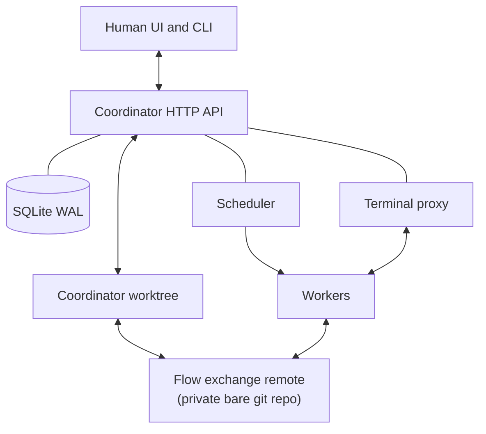

# Flow Design

Flow is a local-first, single-person agentic development workflow system. It is
not a GitHub clone with agents added on. It is a control plane for coordinating
many agent environments while the human acts as architect, reviewer, and TPM.

This is the long-form design history and rationale. For the current implemented
architecture, start with [architecture.md](architecture.md); when this historical
design narrative and current docs disagree, the current architecture/setup/usage
docs are authoritative.

The current worker model differs materially from early pool terminology below.
The coordinator stores project-local durable assignments, and
`flow-orchestrator` recovers them before reserving new work. Each assignment gets
one Kubernetes Job plus Secret or one Darwin child running
`flow-worker --one-shot`. A worker accepts workload buckets but can hold only one
live lease total; legacy positive capacity magnitudes normalize to 1. Treat
references to hot slots or pools as historical rationale, not Deployment
lifecycle guidance.

This document turns the design draft into an implementation-ready design. It
also records the details that needed to be decided before development could
begin.

## Pre-Development Decisions

The draft was architecturally coherent, but several build-spec details were
missing or internally ambiguous. These decisions resolve the blockers:

1. SQLite is durable enough for the local use case, without HA.
   The draft treated SQLite as deliberately losable. Flow will instead treat it
   as the primary local operational store: durable on disk, WAL-backed, and
   expected to survive normal restarts and crashes. The initial design does not
   include replication, failover, or high-availability machinery.

2. Handoffs are coordinator-owned data, not committed files.
   The handoff is submitted to the coordinator at `flow ready` (and optionally
   mid-session via `flow handoff write`) and stored in SQLite as a per-change
   snapshot. It is never committed to the repo, so merges need no handoff
   exclusion, and the next session receives the prior handoff injected into its
   prompt. Flow's merge still omits `.flow/session/**` from the squash commit.

3. The first implementation targets one Go module with three binaries.
   `flow` is the safe client CLI for humans and in-session agents.
   `flow-server` runs the coordinator, bundled web UI, admin setup, and git
   hook entrypoints. `flow-worker` is the worker supervisor. Exact dependency
   versions are pinned when code is scaffolded.

4. The MVP targets local and tailnet workers, not public multi-tenant hosting.
   Multi-user permissions, organizations, public auth flows, GitHub pull-down
   sync, and release/deploy workflows are out of scope.

5. Harness is the only supported agent CLI.
   The watchdog is still implemented in the
   MVP because harness hook support can vary and because missed waiting signals
   would leak hot worker slots.

6. Author completion is explicit.
   An author session becomes reviewable only when the session invokes
   `flow ready`. Harness idle/stop hooks only mean "the agent yielded the turn,"
   never "the work is done."

7. Tasks live in SQLite, not as repo artifacts.
   Task state is coordinator-owned application data. Workers and humans create
   and read tasks through the API, which allocates task IDs transactionally.
   This avoids git merge conflicts and ID collisions when multiple workers
   discover new work concurrently.

8. SQLite migrations are allowed, but pre-1.0 compatibility is not a goal.
   The repository instruction says not to assume backward compatibility unless
   explicitly stated. During early development, destructive migration/reset is
   acceptable for developer builds when it speeds the design.

9. The Flow exchange remote is a first-class component.
   Workers need a shared git rendezvous. Flow therefore owns a private bare git
   remote, named `flow` by default, that workers clone/fetch/push from.
   Existing remotes such as `origin` are left for the user to push manually.

With those decisions made, there were no blocking product-design questions
before development. Automated downstream mirror pushes remain outside the first
build; current assignment provisioning is documented in the authoritative
architecture and deployment guides.

## Goals

- Coordinate personal agentic development across multiple hot or ephemeral
  environments.
- Surface only the human's turn states: mid-session feedback, work-phase gate
  approvals, and final merge acceptance.
- Make the work pipeline composable: users define agent definitions
  (harness, model, reasoning effort, prompt) and arrange them into flows —
  ordered work phases with per-phase human gates plus a review agent set —
  selected per task.
- Keep code, CI check configuration, and trailers in git.
- Keep operational state fast, queryable, and durable enough in local SQLite.
- Make CI, reviewer agents, verifier agents, and author agents variants of one
  job model.
- Provide a board, diff/review view, and terminal attach surface.
- Merge completed work into Flow's exchange remote.

## Non-Goals

- Multi-person permissions, organizations, teams, or shared task ownership.
- GitHub-as-peer synchronization or syncing comments/tasks with external
  systems.
- General DAG workflow orchestration. Flows are linear phase pipelines feeding
  one fixed review/merge tail, not arbitrary graphs.
- Kubernetes-first design. Kubernetes can be a later worker provider.
- Public SaaS hosting.
- Release workflows such as npm publishing. Those remain repo-specific.
- SQLite replication, failover, or HA design.
- Backward-compatible migrations during the early implementation.

## System Overview

Flow has four planes:

- Coordinator: owns HTTP API, SQLite, the in-process lifecycle workflow engine,
  scheduler, derived board views, terminal reverse proxy, and merge actions.
- Worker pool: environments that advertise capabilities, claim jobs, run
  entrypoints in tmux, heartbeat leases, and report events.
- Git: a private Flow exchange remote containing base and task branches,
  repo-versioned check configuration, and `Resolves:` trailers. Handoffs are
  coordinator-owned SQLite snapshots, not branch documents.
- Human UI/CLI: board, diff/review, task editing, scheduling, merge, and
  terminal attach.


```mermaid
graph TB
    UI["Human UI and CLI"] <--> API["Coordinator HTTP API"]
    API --- DB[("SQLite WAL")]
    API --- SCHED["Scheduler"]
    API --- TERM["Terminal proxy"]
    SCHED --> W["Workers"]
    TERM <--> W
    API <--> WT["Coordinator worktree"]
    WT <--> EX["Flow exchange remote\n(private bare git repo)"]
    W <--> EX
```

## Technology Choices

The initial repository should be a Go monorepo:

- `cmd/flow`: client CLI for human and in-session commands.
- `cmd/flow-server`: coordinator daemon, admin setup, and git hook entrypoints.
- `cmd/flow-worker`: worker supervisor and tmux/job execution.
- `internal/api`: HTTP handlers, auth, request/response types. Lifecycle
  handlers authenticate, build a typed event, and call the engine.
- `internal/client`: client command plumbing and API client.
- `internal/coordinator`: single-step domain services (tasks, sessions, checks,
  merges, reviews), the explicit `phase` projection, and the transition-log
  read model.
- `internal/lifecycle`: the in-process workflow engine. It owns the canonical
  task transition table, the `Step` entry point, guards and actions, the
  durable transition log, and the timer/recovery loop.
- `internal/db`: SQLite schema, views, transactions, and embedded migrations.
- `internal/scheduler`: selector/taint matching and queue selection.
- `internal/worker`: worker registration, claim loop, heartbeat, release.
- `internal/worker/execution`: checkout, tmux execution, entrypoint supervision.
- `internal/harness`: harness CLI hook/watchdog integrations.
- `internal/git`: exchange remote, server hooks, branch, trailer, diff, and
  squash-merge helpers.
- `internal/terminal`: tmux/terminal helpers.
- `internal/web`: dependency-light browser UI, embedded and served by the
  coordinator. It uses browser-native custom elements, browser-native JavaScript
  ES modules, and a small Go CSS scoping helper. It does not use React, Vue,
  Svelte, a runtime component framework, a client state manager, or a general UI
  kit.

SQLite is the database. The coordinator is the single writer. The API is
HTTP/JSON, versioned with a `Flow-Protocol-Version` header. The UI may poll in
the first version; server-sent events can be added when useful.

## Existing Repository Onboarding

Adopting an existing repository should not require restructuring the repository
or replacing its current remote. Flow adds local application state and a private
exchange remote.

Happy path:

```text
mkdir -p .flow-local
openssl rand -hex 32 > .flow-local/owner.token
openssl rand -hex 32 > .flow-local/worker-join.token
chmod 600 .flow-local/owner.token
chmod 600 .flow-local/worker-join.token
flow-server serve --data-dir ~/.local/share/flow \
  --owner-token-file .flow-local/owner.token \
  --worker-join-token-file .flow-local/worker-join.token
cp examples/flow-worker.yaml .flow-local/worker.yaml
FLOW_WORKER_JOIN_TOKEN="$(tr -d '\r\n' < .flow-local/worker-join.token)" flow-worker -c .flow-local/worker.yaml
cd /path/to/existing/repo
git status
flow init --repo .
flow task create
flow task schedule t-my-project-0001 up_next
```

`flow init` does not seed role-skill files into the repository. Flow role
instructions are maintained as flat markdown files in the Flow source tree and
compiled into the `flow` binary for prompt generation.

`flow init` (run against the already-running `flow-server`) does the following:

1. Verifies `--repo` is an existing git worktree with at least one commit.
2. Detects or validates the base branch.
3. Creates a Flow project record and SQLite database in Flow's local data
   directory.
4. Creates a private bare exchange remote, normally in Flow's local data
   directory.
5. Adds that remote to the worktree as `flow`, unless a different name is
   supplied.
6. Seeds the exchange remote by pushing only the configured base branch.
7. Installs exchange-remote hooks.
8. Records owner, hook, and coordinator git credentials.
9. Leaves all existing remotes, including `origin`, untouched.
10. Writes a client config so later CLI commands need no `--server`/`--token`.

One global worker config serves every project. `flow-server serve` does not
create it; operators start from `examples/flow-worker.yaml` or another
deployment-specific config, and `flow-worker` joins the server with
`FLOW_WORKER_JOIN_TOKEN` when the config does not contain a worker token.
Project registration does not create a per-project worker config.

Default behavior is deliberately conservative:

- Existing `origin` is not renamed, removed, or used as the active Flow remote.
- Existing feature branches are not imported as Flow task branches.
- Dirty working tree changes are not included in the exchange remote seed.
- No downstream push happens during initialization.
- No committed file is written unless the user asks Flow to create starter
  check configuration.

Useful options:

```text
flow init --repo . --base main
flow init --repo . --base main --exchange-name flow-local
flow init --repo . --base main --name my-project
flow init --repo . --base main --server http://127.0.0.1:8421 --token "$OWNER_TOKEN"
```

Existing remotes such as `origin` remain available for manual user pushes.
Flow does not configure or run downstream mirror pushes in the MVP.


Registration seeds the exchange remote from committed `HEAD`. If the worktree
has uncommitted local changes, Flow still seeds from `HEAD` and prints a warning
that those changes were not included.

If a `flow` remote already exists, init verifies that it points at this
project's server-hosted exchange. Use `--exchange-name` to choose another local
remote name.

The command is idempotent after successful initialization. Re-running it verifies
the project registration, database, exchange remote, configured base branch, and
hooks instead of creating a second Flow project.

## Git Topology and Remote Roles

Flow cares about the active workflow remote. Existing provider remotes such as
GitHub or Codeberg are not part of Flow's active workflow in the MVP; users may
push to them manually outside Flow.

There are two Flow-managed git roles:

1. Coordinator worktree.
   The repository Flow is managing. The coordinator performs squash merges and
   pushes authoritative base-branch updates here. Task state is not edited in
   the worktree.

2. Flow exchange remote.
   A private bare git repository, remote name `flow` by default. Workers clone,
   fetch, and push task branches through the Flow server's authenticated Git
   HTTP route. It is the git rendezvous point for active work and supports
   server-side hooks in the server-owned bare repository.

The exchange route is deterministic:

```text
<caller-configured-flow-server-url>/git/projects/<project-id>/exchange.git
```

The API and job payloads do not advertise or persist an absolute exchange URL.
Each caller already has the Flow server URL it can reach: a host CLI might use
`http://127.0.0.1:8421`, while a Compose worker uses
`http://flow-server:8421`. The caller combines that URL with the project id, so
deployment-specific network addressing stays in client or worker configuration.

The server-hosted exchange allows:

- private WIP branches
- worker fetch/push access
- coordinator base-branch push access
- server-side hooks
- authenticated Git HTTP access from every worker class

### Exchange Refs

Flow uses these refs in the exchange remote:

- `refs/heads/<base>`: protected base branch, normally `main`.
- `refs/heads/task/<task-id>`: active task branch.
- `refs/tags/*`: release tags when explicitly pushed by the coordinator.
- future `refs/flow/*`: internal scratch or archival refs.

Task branch names remain the universal join key. The exchange remote makes that
join key available across machines.

### Server-Side Hooks

Flow installs hooks in the exchange remote. Hooks are guardrails and event
sources; they are not the workflow engine.

`pre-receive` enforces git invariants:

- reject direct base-branch updates unless the push principal is the owner or
  coordinator
- allow owner-principal pushes to task branches for manual edits
- allow local same-user task-branch pushes with no asserted principal when they
  are fast-forward updates
- reject unknown active-work refs outside Flow's namespace
- reject non-fast-forward task-branch updates by non-coordinator principals
- reject `.flow/session/**` on the base branch
- do not require an active Flow session or lease for task-branch pushes

The Flow server authenticates Git HTTP requests with owner, worker, session, or
console credentials, derives the Git principal from that credential, and passes
the principal to the exchange hooks. Project-scoped credentials cannot access a
different project's exchange.

`post-receive` records ref-update events:

- new HEAD for task branches
- base-branch updates
- pushed tags
- actor/principal when available
- push options when available

The hook should append events to a local JSONL spool in the bare repo and, when
the coordinator is reachable, notify the coordinator API. The coordinator drains
the spool and performs SQLite writes. Hooks do not write SQLite directly.

Post-receive events drive useful workflow updates:

- update a change's `head_sha`
- mark automated checks stale when a review branch advances
- parse new `Resolves:` trailers
- enqueue check reruns when a ready/in-review change receives new commits

Manual owner pushes to task branches are first-class workflow input. They are
useful for taking over from an agent, making a quick local fix, or adding review
cleanup by hand. They do not require an active session. The tradeoff is that a
running agent may need to fetch/rebase before its next push; non-fast-forward
rejection prevents either side from silently overwriting the other.

A raw `git push flow task/t-my-project-0001` is accepted when it is an
authenticated, authorized fast-forward update.

Manual owner pushes to the protected base branch are allowed. They bypass
Flow's merge action, which is responsible for setting `merged_at`, closing the
task file, and excluding handoff files, so they are best suited for owner
repairs or syncing a base ref that is not tied to a Flow change.

Periodic reconcile remains the safety net if event delivery is missed.

## Repo Metadata Layout

Flow stores repo-versioned Flow metadata inside the repository:

```text
.flow/
  checks/
    *.yaml
```

`.flow/checks/*.yaml` configures repo-owned automated checks: CI-type commands
whose definition belongs with the code (build, test, lint). Agent reviewers and
verifiers are deliberately NOT repo configuration: whether a harness+model is
available is a coordinator/worker concern, so the agent review set lives on the
project's flows (see Flows and Agent Definitions) where it is editable from the
web UI. Repo checks always merge into a round alongside the flow's review set.

Handoffs are not repo files. The author submits the handoff to the coordinator
at `flow ready` (and optionally mid-session via `flow handoff write`); it is
stored as a per-change snapshot in SQLite and injected into the next session's
prompt, so nothing handoff-related is committed to the branch.

Tasks are intentionally not repo artifacts. They live in SQLite and are exposed
through the coordinator API. The coordinator may later export task snapshots for
backup or public documentation, but generated exports are not the source of
truth and workers do not create task files.

## Work Item Model

Every project work item has a stable identity and exactly one kind:

```text
work_items(id, kind, created_at)  # kind: task | epic | feature
```

Tasks are executable workflow units. Epics and features are containers and can
never receive a workflow run. Epics aggregate organizational work; features add
a long-lived Git branch. The generic work-item API exposes normalized state and
capabilities so callers do not infer epic or feature behavior from task fields.

The organizational hierarchy and dependency graph share one relation table:

```text
work_item_relations(source_item_id, target_item_id, kind, created_by, created_at)
```

- `parent_of P -> C` organizes `C` below the epic or feature `P`. An item has at
  most one parent.
- `blocks A -> B` requires `A` to become terminal before `B` can proceed.
- `related_to` is symmetric and stored in canonical ID order.

Containment contributes the completion dependency `C -> P`. New parent and
blocker edges are checked against this combined graph, preventing a container
from blocking a child that it also needs to finish. Incoming blockers on an
ancestor are effective for every descendant.

Planning artifacts use task-set schema v1 with a mixed `items` array. Each item
declares `kind` and may name a `parent_key`; dependencies may cross kinds. The
materializer creates one root epic related to the executable planning task and
durably records every generated ID so retries resume instead of duplicating Git
branches or database rows.

## Task Model

Tasks are coordinator-owned database records. IDs are allocated in one SQLite
transaction, so concurrent workers can create tasks without git conflicts or
ID collisions. The task ID embeds its normalized project key, making it
globally meaningful even though the numeric sequence remains project-local.

Task fields:

- `id`: stable coordinator-allocated ID, e.g. `t-my-project-0001`; the owning
  project is `p-my-project`.
- `title`
- `body`: sole Markdown field for the task's requirements and specification;
  generated task-set items require a nonblank body
- `priority`
- `schedule_state`: `backlog`, `up_next`, or `closed`
- `triage_state`: `triage`, `accepted`, or `rejected`
- `requires_human_review`
- `auto_merge`
- `flow_id`: nullable reference to the flow driving this task's work phases;
  empty means the project default flow, resolved when work starts
- `created_by`: `human`, `agent`, or `system`
- `created_by_session_id`: nullable session provenance for agent-created tasks
- `source_task_id`: nullable task that led to discovery
- `source_change_id`: nullable change that led to discovery
- timestamps

Human-created tasks default to `triage_state=accepted`. Agent-created tasks
default to `triage_state=triage`, `schedule_state=backlog`, and should usually
carry a system tag such as `agent-discovered`. Agents may create tasks and add
context, tags, and relationships, but may not schedule, close, reject, or merge
tasks.

The `triage` state is a human inbox for discovered work. Accepting a triage
task changes `triage_state` to `accepted`; rejecting it changes
`triage_state` to `rejected` and `schedule_state` to `closed`.
Only accepted tasks can be scheduled or enqueue author jobs.

### Work Item Relationships

Work-item relationships are rows, not columns:

```text
work_item_relations(source_item_id, target_item_id, kind, created_by, created_at)
```

Supported relation kinds for the MVP:

- `parent_of`: `source` is an epic or feature parent; `target` is its child.
- `blocks`: `source` must be terminal before `target` can proceed.
- `related_to`: loose non-scheduling relationship.

Rules:

- No self-relations.
- Duplicate `(source, target, kind)` rows are rejected.
- `parent_of` and `blocks` are acyclic as one combined dependency graph.
- A child can have at most one direct parent.

Parent/child relationships are organizational, but direct child state drives
epic aggregate completion. Blocking relationships gate execution. A task may be
scheduled while blocked; its run remains at the dependency gate until every
effective blocker is terminal.

### Task Tags

Tags are first-class records:

```text
tags(id, slug, name, color, description, created_by, created_at)
task_tags(task_id, tag_id, created_by, created_at)
```

Tag slugs are lowercase, unique, and stable. Display names can change. Agents
may apply existing tags and may create tags when creating a discovered task, but
agent-created tags are marked with provenance so the UI can surface them for
cleanup.

### Agent-Discovered Tasks

A session-scoped token can create and read tasks through the coordinator API.
This is how a worker records work it discovers that is out of scope for its
current task.

Agent-created tasks are constrained:

- created with `created_by=agent` and `created_by_session_id`
- default to `triage_state=triage`
- default to `schedule_state=backlog`
- cannot be scheduled or closed by the session token
- can include tags and relationships at creation time
- can relate back to the current task through `source_task_id`

If the discovered task blocks the current task, the worker can create it with
a `blocks` relationship pointing at the current task. The current task then
derives to `blocked` after its active session ends or is abandoned. If the
worker can still continue its scoped work, it should use `related_to` instead.

### Why Tasks Are Not Git Files

Task creation is a concurrent database operation, not a git authoring
operation. If tasks lived as `.flow/tasks/t-my-project-0007.md`, two workers could
allocate the same next ID locally and race to push conflicting files. The
exchange remote could reject one push, but the losing worker would then need to
renumber the task, rewrite references, and retry. UUID filenames would avoid
the collision but would make task IDs worse for humans and branch names.

The coordinator already serializes writes and owns ID allocation, so task
creation goes through the API. Workers that are offline from the coordinator
cannot create coordinator-backed tasks; they should note the discovery locally
and create the task when the coordinator is reachable.

## Flows and Agent Definitions

The work pipeline — what used to be the hardcoded planning → authoring
progression — is user-composable, per project, stored in the project database,
and editable from the web UI (`/ui/flows`), the CLI, and the API.

Agent definition: a reusable agent configuration.

- `name`: unique per project, e.g. `opus-reviewer`.
- `harness`: `harness`.
- `model` and `reasoning_effort`: optional; serialized into the launch command
  (`--model X --reasoning Y`). Empty means the harness default.
- `prompt`: the role-instruction markdown. It replaces the embedded
  `skills/flow-*.md` content in the session's prompt; task context (title,
  Markdown body, prior handoffs, review state) is still appended by `flow
  fetch-prompt`.

Flow: an ordered work pipeline plus its review configuration.

- `phases`: an ordered list of work phases. Each phase names itself (e.g.
  `spec`), references an agent definition, and declares an exit `gate`:
  - `auto`: the next phase's job is enqueued immediately when the phase
    completes.
  - `human`: the flow pauses; a human reviews the phase's handoff in the UI and
    either approves (advance) or requests changes (the same phase re-runs with
    the feedback injected into its prompt).
- `review_agents`: which agent reviewers (critique) and verifiers (acceptance)
  run once the final phase publishes the change. Repo `.flow/checks/*.yaml`
  CI checks always merge in; an empty review set deliberately runs repo checks
  alone.
- `fix_agent_def_id`: optional agent for review fix rounds; the default is the
  final work phase's agent.

Each project seeds built-in configuration on first open so a fresh project
works with zero setup: agent defs `planner`, `author`, `reviewer`, and
`verifier` (prompts copied from the embedded skills, default harness), plus two
flows — `direct` (`implement` only; the project default) and `planned`
(human-gated `plan`, then `implement`). These reproduce the old fixed behavior
and are ordinary rows the user can edit or replace.

Snapshot semantics: when an task's work starts (its first author job is
ensured), the coordinator freezes the resolved flow — phases with full
agent-def copies, review set, and fix agent — into a per-task flow cursor
(`task_flow_cursor.flow_snapshot_json`). Editing or deleting a flow never
changes an in-flight task; unscheduled tasks resolve the live flow when they
start, and a deleted flow falls back to the project default. Referenced agent
definitions cannot be deleted while a flow uses them; the default flow cannot
be deleted.

Phase execution model:

- Every phase runs as a fresh author-role job/session (phases may use different
  harnesses, so sessions never continue across phases). The job payload carries
  the phase coordinates (`phase_name`, `phase_index`, `final_phase`,
  `gate_feedback`) and an entrypoint built from the phase agent's harness and
  model selection.
- `flow ready` is the single completion signal for every phase. Each phase
  submits a handoff; the engine copies it into a per-phase store
  (`task_phase_handoffs`) and injects completed phases' handoffs into later
  phases' prompts. Only the final phase's `flow ready` publishes the change
  into review; intermediate handoffs are the phase's artifact (a spec, a plan)
  and only need to be non-empty, while the final phase's handoff must follow
  the Flow Handoff template.
- Prompt material is resolved server-side: sessions call
  `GET /tasks/{id}/prompt-context` (with `?check=<name>` for review checks) to
  receive the frozen agent prompt, gate feedback, and prior-phase handoffs, so
  prompts always reflect the snapshot the task is actually running.

## Identity and Naming

IDs use stable prefixes:

- Task: `t-my-project-0001`
- Session: `s-<random>`
- Change: `ch-my-project-0001` (then `ch-my-project-0001-2`, etc. for additional changes on the task)
- Job: `j-<random>`
- Lease: `l-<random>`
- Check: `ck-<random>`
- Thread: `th-<random>`
- Comment: `cm-<random>`
- Worker: `w-<configured-or-random>`

Feature branch names are the universal join key:

```text
task/t-my-project-0001
```

Task titles can change without changing branch names.

## Domain Model

Flow's core nouns are Task, Session, Change, Agent Definition, Flow, and the
per-task Flow Cursor.

Task:

- Stable task identity and editorial content.
- Stored and queried in SQLite.
- Owns scheduling knobs: `schedule_state`, `priority`,
  `requires_human_review`, and `auto_merge`, plus the `flow_id` selection.
- Can have tags and relationships to other tasks.

Agent Definition and Flow:

- Project-owned configuration rows (see Flows and Agent Definitions): reusable
  agent configs, and ordered phase pipelines with gates and review sets.

Flow Cursor:

- The task's frozen position within its flow: the resolved snapshot plus
  `phase_index` and `phase_state`
  (`pending`, `running`, `awaiting_approval`, `completed`) and any gate
  feedback. Owned by the lifecycle engine; mutations are compare-and-swap on
  the phase index so at-least-once event delivery stays idempotent.

Session:

- One engagement by a worker environment against an task.
- Has role `author`, `reviewer`, or `verifier`.
- Has runtime state `starting`, `working`, `waiting`, `finished`, `crashed`, or
  `abandoned`.
- Holds transcript path, worker, lease, and harness.
- Can suspend/resume many times.

Change:

- Code artifact represented by branch plus base.
- Usually created when an author session starts.
- Becomes reviewable when the author calls `flow ready`.
- Reuses the same task branch across review/fix rounds.
- Stores only durable lifecycle fact `merged_at`; review status is derived.

SQLite enforces one active author session per task with a partial unique index
and one live author job per task with a separate partial unique index. Active
session runtime states are `starting`, `working`, and `waiting`. Live job states
are `queued`, `claimed`, and `running`.

## SQLite Model

The database holds the local operational state:

- `tasks`: task fields, scheduling, triage, flow selection, provenance, and
  timestamps.
- `agent_defs`: reusable agent configurations (harness, model, effort, prompt).
- `flows`, `flow_phases`, `flow_review_agents`: the project's flow catalog —
  ordered phases with gates plus the review agent set and fix agent.
- `task_flow_cursor`: the task's frozen flow snapshot and phase position.
- `task_phase_handoffs`: per-phase completion artifacts (specs, plans, the
  final handoff), shown at gates and injected into later phases' prompts.
- `work_item_relations`: parent/child, blocker, and related task links.
- `tags`: tag definitions.
- `task_tags`: many-to-many task tags.
- `sessions`: worker engagements and runtime state.
- `changes`: branch/base/merge facts.
- `jobs`: unified queue for agent, verifier, reviewer, CI, and push jobs.
- `leases`: worker job ownership with expiry and release state.
- `workers`: labels, taints, endpoint, heartbeat, and cordon state.
- `checks`: human/agent/CI verdict rows.
- `threads`: review comments anchored to immutable commits.
- `comments`: thread discussion.
- `status_log`: lossy TPM/status feed.
- `tokens`: hashed coordinator, worker, and session credentials.
- `workflow_state`: the explicit, authoritative lifecycle `phase` per task,
  with an optimistic `version`.
- `transitions`: the append-only lifecycle transition log (audit and replay).
- `timers`: durable timers the background ticker drains for crash recovery and
  retries.

Required pragmatics:

- WAL mode.
- Foreign keys enabled.
- Coordinator is the only SQLite writer.
- `BEGIN IMMEDIATE` around job claim and state transitions.
- Partial unique index for unreleased lease per job.
- Partial unique index for active author session per task.
- Partial unique index for live author job per task:
  `kind='agent' AND role='author' AND state IN ('queued','claimed','running')`.
- Unique normalized tag slugs.
- Unique relation rows and cycle checks in coordinator transitions.
- Views for board lane and review state.

## Derived State

The board is a view derived in two steps. First, each open task gets a
fine-grained sub-state. Precedence, top wins:

1. `done`: task `schedule_state=closed` or `change.merged_at IS NOT NULL`
   (skipped; not shown on the board).
2. `ready_to_merge`: review state is `approved`, `auto_merge=false`, and not
   merged.
3. `changes_requested`: any required check verdict is `blocked`.
4. `in_progress`: active session is `starting`, `working`, or `waiting`, or
   the flow cursor pins the task mid-pipeline (paused at a human gate, or
   between phase jobs past the first phase).
5. `triage`: task `triage_state=triage`.
6. `in_review`: an unmerged ready change with review state `in_review`.
7. `up_next`: task `schedule_state=up_next`.
8. `backlog`: everything else.

A human wait is a `wait_reason` overlay on the sub-state, not a sub-state of
its own. Current wait reasons include `phase_approval` (a work phase's handoff
awaits gate approval), `question`, `manual_merge`, and `blocked`.

Second, the sub-state coarsens into one of the board's three lanes, grouped by
who acts next:

| Lane | Sub-states | Meaning |
| --- | --- | --- |
| `scheduled` | `up_next` | waiting for an agent to pick it up |
| `working` | `in_progress` (executing or awaiting worker) | automation is working |
| `waiting` | `in_review`, `changes_requested`, wait reasons, `ready_to_merge`, blocked overlay | waiting on a human or the next step |

The sub-state is surfaced as a pill on task cards, alongside a flow-phase
pill (`plan 1/2`, with awaiting-approval styling at a gate) when the task has
a flow cursor; `blocked` is a derived overlay (unresolved `blocks` relations)
rendered as a warning pill and grouped under the `waiting` lane, never a lane
of its own.

Review state is also derived:

1. `merged`: `merged_at` is set.
2. `changes_requested`: any required check is `blocked`.
3. `approved`: all required checks are `satisfied`.
4. `in_review`: otherwise.

No actor writes a board lane or review state.

The lifecycle engine additionally maintains an explicit `phase` per task in
`workflow_state` (see Task Lifecycle). The board lane and review-state views
remain derived and authoritative for those projections; the explicit `phase` is
an overlay that the engine recomputes from the same underlying state on every
transition, providing a durable, auditable coordinate and the timeline view.
`blocked` stays a derived overlay and is never stored as a phase.

## Task Lifecycle

1. Human creates an task with `flow task create [--flow <flow>]`.
2. Task starts in `backlog`.
3. Human schedules it with `flow task schedule t-my-project-0001 up_next`.
4. Coordinator freezes the task's flow into its cursor (the selected flow, or
   the project default) and enqueues the first phase's author job if the task
   is accepted, no active or queued author job/session exists, and no
   unresolved blocker exists.
5. Worker claims the job, creates/checks out `task/t-my-project-0001`, starts tmux, and
   runs the entrypoint built from the phase agent's harness and model
   selection.
6. The session alternates between `working` and `waiting`.
7. The agent calls `flow ready` when its phase is done, piping the phase's
   handoff on stdin.
8. For an intermediate phase, the engine stores the handoff and either
   enqueues the next phase's job (`gate=auto`) or pauses awaiting approval
   (`gate=human`). At a gate the human approves (advance) or requests changes
   (the same phase re-runs with the feedback in its prompt). Steps 5-8 repeat
   per phase.
9. The final phase's `flow ready` publishes the change: the coordinator
   releases the hot slot and starts critique checks — the flow's review agents
   plus repo `.flow/checks` CI checks.
10. Review loop runs until review state is `approved`.
11. If a required check blocks the change, Flow enqueues a fix author job on
    the same task branch (using the flow's fix agent) when no active or
    queued author job exists.
12. Each fix round creates a new author session row and reuses the same change
    and branch.
13. The author fixes the branch, pushes, and calls `flow ready` again.
14. Flow reruns required critique checks for the new HEAD.
15. If `auto_merge=true`, coordinator merges automatically.
16. If `auto_merge=false`, the board shows the task in the waiting lane with
    a `ready_to_merge` pill until the human clicks merge.
17. Merge sets `merged_at`, sets the task `schedule_state=closed`, and removes
    the task from the board.

Agent-discovered tasks enter the backlog as unscheduled work with a `triage`
sub-state pill instead of the normal backlog. The human can accept, edit, tag,
relate, schedule, or reject them.

### Lifecycle Engine

The lifecycle above is implemented as an explicit, durable in-process workflow
engine (`internal/lifecycle`) rather than as cascades hand-wired into HTTP
handlers. The engine owns the task finite-state machine; lifecycle API handlers
shrink to "authenticate, build a typed event, call `engine.Step`".

Each task carries an authoritative `phase` in `workflow_state`:

```text
triage  backlog  up_next  working
critique  acceptance  approved
merged_closed  rejected_closed  abandoned
```

`phase` is a projection of the existing state mechanisms (schedule/triage
columns, the review-state view, change ready/merged latches, active author
sessions, and the flow cursor). It is recomputed by the same precedence the
board sub-states use, so each phase maps deterministically into one of the
board's lanes. `blocked` remains a derived overlay and is never stored.

`working` is a container phase: the entire user-composed work pipeline runs
inside it, and the task's position within the pipeline lives on the flow
cursor (snapshot + `phase_index` + `phase_state`), not in `workflow_state`.
This keeps the FSM's transition table static and reviewable while phases,
gates, and agents remain user configuration. The cursor alone can pin an task
in `working` — paused at a human gate, or between phase jobs — even with no
active session. Custom phase names surface through the cursor on the board and
task views; the transition log records the gate and advance events.

The canonical workflow specification is a single Go table,
`internal/lifecycle/transitions.go`, expressed as
`[]Transition{From, On, Guard, Action, To}` rows. Reviewing one file shows every
legal edge. Events are typed, one per external input — `ScheduleTask`,
`TriageTask`, `SessionReady` (the phase-completion signal behind `flow
ready`), `WorkPhaseApproved`, `WorkPhaseRework`, `CheckReported`,
`MergeRequested`, the thread events — plus bounded internal follow-on events
(for example scheduling emits `EnsureWorkPhaseJob` to freeze the cursor and
enqueue the current phase's job, a blocked required check emits a guarded
`EnsureFixAuthorJob` edge, and an approved auto-merge task emits an
`AutoMerge` edge).

Cursor mutations are engine effects with compare-and-swap semantics (advance
from index N, pause at N, resume at N with feedback, complete at N), so the
engine's at-least-once delivery and version-conflict retries cannot
double-advance a pipeline. The work-phase dwell deadline re-arms per phase and
declines to escalate while a gate deliberately waits on a human.

`engine.Step` is the single entry point. For one event it:

1. resolves the target task and loads a snapshot,
2. looks up the transition for `(phase, event)` and evaluates its guard,
3. runs the action, whose side effects go through an injected `Effects` seam so
   the engine is a deterministic reducer and testable with a fake,
4. recomputes and writes the new `phase`, and appends an append-only row to
   `transitions`, atomically under a single `BEGIN IMMEDIATE` write, and
5. applies any bounded follow-on events in order (a depth-capped cascade).

Side effects reuse the existing single-step coordinator mutators; the engine only
decides which jobs to enqueue and when. The transition log records the event,
guard result, from/to phase, actor, and time, giving an audit trail and a replay
basis. Idempotent replay of a transition is a no-op and never re-runs effects.

Durable recovery runs on the daemon's first real background ticker. A single
goroutine in `flow-server serve` drains due `timers` and runs crash recovery
(reconciling crashed author sessions and re-enqueuing their work) on an interval,
so recovery fires regardless of inbound API traffic — closing the gap where the
old lazy sweep only ran when a request happened to pass through a handler. The
in-line sweeps remain as defense-in-depth. The engine stays single-process and
single-writer, consistent with the rest of Flow.

The per-task transition history is surfaced three ways: `GET
/tasks/{id}/transitions`, a `flow transitions <task-id>` CLI command, and a
Lifecycle section on the task detail view.

## Job Queue and Leases

CI and agents share one queue. A job has:

- `kind`: `agent`, `ci`, or `push`.
- `lifetime`: `persistent` or `ephemeral`.
- `role`: `author`, `reviewer`, `verifier`, or null for CI/push.
- `task_id`, `change_id`, and optional `check_id`.
- `priority`.
- selectors and tolerations.
- entrypoint spec.
- state `queued`, `claimed`, `running`, `done`, or `failed`.

Claim ordering:

1. Highest priority.
2. Oldest queued job.
3. Cheapest eligible worker class, so scarce capabilities remain free.

A lease tracks environment liveness, not agent activity. A `waiting` session
continues heartbeating and keeps its worker slot. This is the intended
backpressure mechanism.

Slot behavior:

- `waiting` session: slot held, idle-hot.
- `working`: slot held.
- `ready`/`in_review`: slot released.
- `crashed`: slot released, job may be re-enqueued.
- `abandoned`: slot released, no automatic re-enqueue.

The crash sweeper marks expired unreleased leases as crashed and re-enqueues the
same branch for warm/cold resume. The lifecycle engine's background ticker runs
this sweep on an interval, so a crashed worker recovers even with no inbound API
traffic; request-time sweeps remain as a safety net.

Author job enqueue is guarded. Flow enqueues an author or fix-author job only
when all of these are true:

- the task is accepted and not closed
- the task has no unresolved blockers
- the change is not merged
- no active author session exists for the task
- no queued, claimed, or running author job exists for the task

Initial author jobs create the change and task branch when needed. Fix-author
jobs reuse the existing change and `task/<task-id>` branch.

Author-job enqueue is idempotent for the same task/change/branch. If a live
author job already exists with matching inputs, the coordinator returns that job
instead of creating a duplicate. If a live author job exists for the same task
but points at a different change or branch, enqueue fails with an internal
consistency error so the state can be inspected rather than hidden.

## Entrypoint Configuration

Flow has three entrypoint sources:

1. Flow/agent-definition configuration (the normal case).
   Author-phase and fix-round jobs build their entrypoint from the task's
   frozen flow snapshot: the phase agent's harness launch template plus its
   serialized model/reasoning selection, appended to coordinator-level harness
   args. The flow's review agents build reviewer/verifier check commands the
   same way.

2. Repo-versioned check configuration.
   `.flow/checks/*.yaml` defines repo-owned CI-type jobs with explicit
   entrypoints. These merge into every review round regardless of flow.

3. Coordinator configuration.
   `author_entrypoint` in the coordinator config, when set, overrides the
   generated author entrypoint wholesale (test/dev escape hatch), and
   coordinator `harness_args` contribute additive argv tokens to generated
   commands. Manual fake CI jobs can supply an explicit entrypoint when
   enqueued.

Entrypoints are stored as structured data, not as an implicit shell string:

```yaml
entrypoint:
  argv: ['harness -p "$(flow fetch-prompt)"']
  cwd: "."
  env: {}
  shell: true
```

`argv` is executed directly when `shell=false`. Shell entrypoints are allowed
only when explicitly marked and run through the platform shell. Entrypoint
records may also carry job metadata such as `lifetime`, `role`, `phase`,
selectors, and tolerations.

## Scheduling

Workers advertise labels and taints:

```yaml
labels:
  os: linux
  arch: arm64
  size: medium
  agent: true
  docker: true
taints:
  - key: lifetime
    value: persistent
    effect: NoSchedule
accepts:
  - persistent_agent
  - ephemeral
```

Jobs carry selectors and tolerations:

```yaml
runs_on:
  os: linux
  arch: arm64
requires: [agent, docker]
size: medium
tolerations:
  - key: lifetime
    value: persistent
    effect: NoSchedule
```

A worker is eligible when:

```text
job label requirements exactly match worker labels
AND every worker taint is tolerated by the job
AND the matching capacity bucket has room
```

Labels are normalized key/value pairs. Bare labels in config are shorthand for
`key=true`; for example, `requires: [agent, docker]` means `agent=true` and
`docker=true`.

Reserved label keys:

- `os`: `linux`, `macos`
- `arch`: `x86_64`, `arm64`
- `size`: configured size name, initially `small`, `medium`, or `large`
- `agent`: `true` or `false`
- `docker`: `true` or `false`

Job selectors compile to exact key/value requirements. The example above
requires `os=linux`, `arch=arm64`, `size=medium`, `agent=true`, and
`docker=true`.

Taints are structured triples: `key`, `value`, and `effect`. The MVP supports
only `NoSchedule`. A toleration matches a taint only when key, value, and effect
all match. If a worker has any untolerated taint, the job is not eligible.

Admission-only taints are supported. `NoExecute` is not supported because Flow
must not evict hot agent sessions.

Capacity buckets are explicit. Persistent author/reviewer/verifier agent jobs
use the `persistent_agent` bucket. CI/check jobs use the `ephemeral` bucket;
*ephemeral* is workload terminology, not a worker lifecycle mode. Canonical
worker configuration lists accepted buckets. Legacy positive capacity values
normalize to 1, and one worker identity can hold only one live lease total.

## Worker Job Contract

The worker does the same setup for every job:

1. Claim job and lease.
2. Clone or fetch from the Flow exchange remote.
3. Checkout/create the branch.
4. Export environment variables.
5. Install known harness hooks.
6. Start a tmux session.
7. Resolve and run the job entrypoint inside tmux.
8. Heartbeat until terminal state.
9. Report terminal state and release the lease when appropriate.

Important environment variables:

- `FLOW_COORDINATOR_URL`
- `FLOW_SESSION_TOKEN`
- `FLOW_TASK_ID`
- `FLOW_SESSION_ID`
- `FLOW_CHANGE_ID`
- `FLOW_BRANCH`
- `FLOW_BASE`
- `FLOW_JOB_ID`
- `FLOW_CHECK_NAME`
- `FLOW_WORKER_ROLE`
- `FLOW_WORKER_HARNESS`
- `FLOW_ROLE`
- `FLOW_COMPLETION_PROTOCOL`, `FLOW_CHECK_MODE`, and `FLOW_COMPLETION_FILE`:
  present only for Flow-owned interactive reviewer/verifier checks. The agent
  writes `$FLOW_VERDICT_FILE` and runs `flow complete`; the worker ends the
  terminal only after verifying the resulting digest-bound completion seal.
- `FLOW_PHASE_NAME`, `FLOW_PHASE_INDEX`, `FLOW_PHASE_FINAL`: the author job's
  work-phase coordinates. `FLOW_PHASE_FINAL=false` relaxes `flow ready`'s
  handoff-template validation (intermediate phase artifacts only need to be
  non-empty).

Entrypoint contract:

```text
environment variables in
-> entrypoint runs inside tmux
-> lifecycle events, comments, status, and verdicts out through flow CLI
-> Flow-owned agent checks finish through `flow complete`; custom checks and CI
   retain their configured process-exit semantics
```

Author entrypoints should `exec` the harness so process-state detection can
reliably inspect the foreground process.

## Flow Commands

Flow builds three binaries from one Go module. The split follows authority
boundaries, not product boundaries.

### `flow`

`flow` is the client binary. It is safe to place in an agent session's PATH
because it does not contain coordinator or worker entrypoints.

In-session commands:

```text
flow fetch-prompt [--harness harness|agents]
flow status "<message>"
flow handoff write   # optional progress snapshot (reads stdin), submitted to the coordinator
flow task list [--tag <tag>] [--blocked-by <task-id>]
flow task show <task-id>
flow task create --title "<title>" --body "<body>" [--tag <tag>] [--blocks <task-id>] [--related <task-id>]
flow comment <sha>:<file>:<line> "<body>"
flow thread reply <thread-id> "<body>"
flow thread claim <thread-id> fixed|not_warranted|superseded [--body "<rationale>"]
flow verdict satisfied|blocked
flow ready           # completes the current work phase: reads the handoff on
                     # stdin and pushes the branch; only the final phase
                     # publishes the change into review
```

`flow fetch-prompt` reads the Flow worker environment for author, reviewer, and
verifier jobs, resolves the phase/check agent prompt from the coordinator's
prompt context (falling back to the embedded role skills when no flow cursor
exists), appends task context, prior-phase handoffs, and gate feedback, and
emits the initial harness prompt. `flow init` does not seed role skills into project
repositories, and `flow-worker` does not validate committed skill files in the
worker checkout before starting the entrypoint. `FLOW_WORKER_HARNESS` is set by
`flow-worker` from the
entrypoint command; `--harness harness|agents` is an explicit
override.

Human commands:

```text
flow task create [--flow <flow-id-or-name>]
flow task edit <task-id>
flow task schedule <task-id> backlog|up_next
flow task close <task-id>
flow task triage accept|reject <task-id>
flow task tag add|remove <task-id> <tag>
flow task link <source-id> parent-of|blocks|related-to <target-id>
flow task unlink <source-id> parent-of|blocks|related-to <target-id>
flow phase approve <task-id>
flow phase request-changes <task-id> --feedback "<text>"
flow flows list|create|edit|rm|set-default    # create/edit take -f flow.yaml
flow agent-defs list|create|edit|rm           # create/edit take -f agent.yaml
flow board
flow attach <session-id>
flow attach --job <job-id>
flow merge <task-id|change-id>
flow reconcile
```

Diagnostics:

```text
flow workers
flow jobs
flow checks <change-id>
flow doctor
```

### `flow-server`

`flow-server` owns coordinator authority and local administrative setup:

```text
flow-server serve                # run coordinator API and web UI; serves all projects
flow-server git-hook pre-receive # invoked by exchange remote hook
flow-server git-hook post-receive
```

`flow-server` is installed on the coordinator host and in the exchange remote's
hook environment. It should not be installed in agent session PATHs.

### `flow-worker` and `flow-orchestrator`

`flow-worker` owns worker authority. Assignment workers run:

```text
flow-worker -c worker.yaml --one-shot
```

It registers the worker, claims its assignment-bound job, holds the
worker-scoped credential, prepares the git worktree, starts tmux, injects only
the session token into the job environment, supervises heartbeats, and releases
the lease. The one-shot lifecycle exits after one reported job outcome and is
signal-aware; lease recovery remains authoritative if interruption prevents a
terminal report.

`flow-orchestrator` uses an orchestrator-scoped credential to reconcile durable
assignments. It creates one Kubernetes Job/private Secret or Darwin child per
assignment, passes a direct worker credential, revokes that credential through
assignment abandonment/cleanup, and performs recovery and cleanup before new
reservation.

The four binaries share protocol types and version metadata. The protocol
version is compiled into each binary rather than configured by users.
Coordinator, worker, and client requests still use `Flow-Protocol-Version`;
startup should fail clearly when binary versions are incompatible.

Authority still comes from credentials. The binary split is defense in depth and
deployment hygiene: `flow` lacks privileged server/worker entrypoints, while
`flow-server` and `flow-worker` still reject requests without the proper scoped
credential.

## Protocol

Transport is HTTP/JSON over TLS for remote workers. Local-only development may
bind to loopback without TLS.

Every request includes:

- `Flow-Protocol-Version`
- bearer token appropriate to the actor
- optional idempotency key for mutating human and session operations

Standard error shape:

```json
{
  "error": {
    "code": "invalid_state",
    "message": "session is already finished",
    "details": {}
  }
}
```

Core endpoints:

```text
POST /tasks
GET  /tasks
GET  /tasks/{id}
PATCH /tasks/{id}
POST /tasks/{id}/schedule
POST /tasks/{id}/close
POST /tasks/{id}/triage
GET  /tasks/{id}/transitions
POST /tasks/{id}/tags
DELETE /tasks/{id}/tags/{tag}
GET  /tags
POST /tags
POST /task-relations
DELETE /task-relations/{id}

GET  /board
GET  /changes/{id}/diff
POST /changes/{id}/merge

POST /workers/register
POST /workers/claim
POST /workers/heartbeat
POST /workers/renew
POST /workers/release
GET  /jobs/{id}/attach

POST /sessions/{id}/event
POST /sessions/{id}/status
POST /sessions/{id}/ready
GET  /sessions/{id}/attach

POST /changes/{id}/checks/{name}
POST /changes/{id}/comments
POST /threads/{id}/comments
POST /threads/{id}/claims

POST /git/events
GET  /queue/pressure
POST /reconcile
```

Workers initiate the control plane. The coordinator does not open control
connections to workers. Terminal attach is brokered by the coordinator over worker-initiated
WebSocket streams.

## Detection and Human Feedback

Harness hooks and the watchdog only classify turn ownership:

- `working`: agent has the turn.
- `waiting`: human has the turn.

They do not infer completion.

Detection tiers:

1. Native harness hooks.
   The harness CLI reports session, prompt-submit, tool, compaction, and stop
   events through its native hooks.

2. Universal watchdog.
   tmux silence plus process-state inspection detects foreground processes
   blocked on tty input while child processes are quiet.

3. Long-idle watchdog.
   Any session idle beyond a configured threshold surfaces as needs-feedback to
   avoid leaked hot slots.

Feedback is direct stdin. The human attaches to tmux through the UI or
`flow attach` and types into the harness. There is no separate feedback routing
protocol.

## Durability Ritual

Author sessions must commit often, including WIP commits. On each meaningful
commit they also:

1. Post a status line.
2. Keep the branch push/clone recoverable.

At `flow ready` the session submits the handoff to the coordinator (piped on
stdin); it may also push an interim handoff snapshot mid-session with
`flow handoff write`. An intermediate work phase's handoff is the phase's
artifact — a spec, a plan — reviewed at approval gates and injected into later
phases' prompts; it only has to be non-empty. The final, change-publishing
phase's handoff must include:

- Current goal.
- Completed work.
- Remaining work.
- Tests run and results.
- Failed approaches and why they were rejected.
- Important files and commands.
- Next recommended action.

Hot resume normally uses the live tmux session. Cold resume uses the handoff
snapshot the coordinator stored at the last `flow ready` or `flow handoff write`,
injected into the new session's prompt.

## Review Model

Everything that can approve or block a change is a check:

- human reviewer
- agent reviewer
- verifier agent
- CI/test job

Internal verdicts are normalized:

- `pending`
- `satisfied`
- `blocked`
- `skipped`

There are two phases:

1. Critique phase.
   Tests, reviewer agents, and optional human review run against current HEAD.
   Automated reviewers are pure functions of the current code and rerun every
   round.

2. Acceptance phase.
   The verifier audits the requirements in the task body and claimed thread
   resolutions after critique settles.

Agent reviewer and verifier checks come from the task's frozen flow snapshot:
one check per review agent, named after its agent definition, launched with
that agent's harness and model/effort selection, and prompted with its agent
prompt. Repo `.flow/checks/*.yaml` CI checks always merge into the round. A
flow with an empty review set deliberately runs repo checks alone. Tasks
without a flow cursor (a project with no flows configured) fall back to
synthesized default reviewer/verifier checks using the bundled instructions.

Reviewer checks clear only by rerunning and producing `satisfied`. Authors do
not mark reviewer verdicts as fixed.

Human reviewers and reviewer agents use the same SQLite-backed thread/comment
model. Reviewer agents receive the current review context before each round:
existing open, claimed, reopened, and certified threads; their discussion
comments; the current diff; and any projected thread locations at HEAD. They
should avoid duplicating prior feedback. If an existing thread still applies,
the reviewer should reply to that thread or leave it blocking instead of opening
a duplicate thread. If the same concern appears in a new location or the
original anchor no longer projects cleanly, the reviewer may open a new thread
and reference the older one.

When required checks block a change, Flow sends the task back to a fix round
automatically if it can be worked: the task is accepted, unmerged, unblocked by
other tasks, and has no active or queued author job. The fix job runs the
flow's fix agent (default: the final work phase's agent) in a new author
session on the same change branch. When that session calls `flow ready`, Flow
treats the branch's new HEAD as the next review round and reruns required
critique checks before verifier acceptance.

## Threads and Resolution

Threads are anchored to immutable coordinates:

```text
commit_sha + file + line + context lines
```

The UI may project the anchor forward to HEAD for display. If projection fails,
the thread is shown as outdated against its original commit.

Review threads and comments are SQLite-backed application data. SQLite is the
durable source of truth for review discussion, thread state, claim state, and
comment bodies.

Thread states:

- `open`: reviewer filed a concern.
- `claimed`: author says the concern has been addressed.
- `certified`: verifier confirms the claim.
- `reopened`: verifier rejects the claim.

Claim kinds:

- `fixed`: the author changed code and claims the concern is fixed.
- `not_warranted`: the author explains why no code change should be made.
- `superseded`: the author claims another change made the concern irrelevant.

`fixed` claims normally use git trailers parsed with `git interpret-trailers`:

```text
fix: handle token refresh race

Resolves: th-7f3a91
```

The trailer is a claim, not closure. It moves a known thread to
`claimed(kind=fixed)` and records the claiming commit. Only the verifier
certifies closure.

Authors can also reply directly to a review thread. This is required for
`not_warranted` and `superseded` claims and is useful for explaining a fix. A
claim without a code change must include a rationale comment. The next
review/verifier round decides whether the rationale is acceptable. If it is
acceptable, the verifier certifies the thread. If not, the verifier reopens it
with an explanation.

## Human Gates

Flow has three independent human gates:

- Work-phase gates: a flow phase with `gate=human` pauses after the phase
  completes; the human reviews the phase's handoff and approves or requests
  changes. This generalizes the old plan-approval gate — the seeded `planned`
  flow is exactly a human-gated `plan` phase before `implement`.
- `requires_human_review`: creates a required human reviewer check in the
  critique phase.
- `auto_merge=false`: requires a final human merge action after review state is
  approved.

The default is:

```text
requires_human_review=false
auto_merge=false
```

This lets agents review and certify while the human retains the final merge
click.

## Merge

The approved barrier triggers merge.

Manual merge:

```text
flow merge <change-id>
```

Automatic merge happens when `auto_merge=true` and review state becomes
`approved`.

Merge behavior:

1. Fetch base and task branch from the Flow exchange remote.
2. Build a squash commit from branch diff against base.
3. Exclude `.flow/session/**`.
4. Preserve code changes.
5. Set `merged_at`.
6. Set the task `schedule_state=closed` in SQLite.
7. Push the base-branch update to the Flow exchange remote as the coordinator.

Downstream publication is outside Flow's MVP scope. Users can push from their
own worktree or from the exchange remote to provider remotes manually. External
feedback is manually re-entered as Flow tasks or threads.

## Reconciliation

`flow reconcile` repairs drift between SQLite and git-backed metadata. It is a
recovery and maintenance tool, not the normal durability model:

1. Fetch from the Flow exchange remote.
2. Scan `refs/heads/task/t-<project-key>-*` branches.
3. Verify each task branch maps to a known SQLite task.
4. Create missing change rows for known branches when enough metadata exists.
5. Parse `Resolves:` trailers and mark matching known threads as
   `claimed(kind=fixed)`.
6. Mark unknown historical thread IDs as unresolved historical references.

Handoffs are coordinator-stored (submitted via `flow ready`/`flow handoff
write`), so reconcile no longer reads them from branch refs.

SQLite is durable enough for the local MVP and is the source of truth for
operational state, tasks, review discussion, and check history. If the database
is lost or corrupted, reconciliation can recover only the parts that were also
represented in git. It cannot recover:

- tasks, tags, or task relationships
- status feed entries
- check verdict history
- review thread/comment bodies or claim state
- live tmux sessions
- leases

Those losses are outside the normal operating model. Flow does not mirror review
discussion into git; users should treat the SQLite database like ordinary
durable local application data.

## UI Requirements

The first UI is a work surface, not a landing page.

### Web Technology Direction

The web surface should keep the dependency footprint small and make the server
the source of truth.

- Use browser-native custom elements for reusable UI. Prefer ordinary DOM,
  custom events, native forms, `<dialog>`, and History API routing before adding
  libraries.
- Use CSS Modules for scoped component styles. There should be no Tailwind,
  Bootstrap, design-system package, CSS-in-JS runtime, or icon framework in the
  MVP.
- Use browser-native JavaScript modules for component logic. Avoid code
  generators unless the API surface grows enough to justify them.
- Keep client state as a short-lived cache of coordinator read models. The UI
  never stores board lanes, review state, check verdicts, or terminal state as
  authoritative data.
- Prefer server-composed read models over client N+1 request chains for board,
  inbox, and change-detail screens.
- Keep the build as static assets embedded into `flow-server`. The current
  implementation serves native ES modules and runs a small Go CSS scoping helper
  instead of a frontend bundler.
- Treat heavier browser packages as explicit exceptions. A dependency such as a
  terminal or diff library must replace a clearly risky local implementation;
  otherwise Flow should render its own focused UI.

Required views:

- Board: derived lanes, task cards, active status, check summary, attach/merge
  actions, and quick links to detail views. Lanes are read from the coordinator;
  drag-and-drop is not required for the MVP.
- Triage inbox: agent-discovered `triage` tasks with provenance, tags,
  relationships, and explicit accept/reject/edit actions.
- Needs Attention inbox: tasks with wait reasons or required human actions,
  including the active session, latest status line, handoff summary, terminal
  attach action, and manual merge actions.
- Merge inbox: `ready_to_merge` changes with check summary, diff stats, branch
  head, and the merge action when human action is required.
- Task detail: title, Markdown body, tags, relationships, the task's flow
  (phase chain with agents and gates, current position),
  schedule/triage/close controls, status feed, active and historical sessions,
  linked change state, and a Lifecycle timeline of phase transitions. When a
  phase awaits gate approval, a prominent panel renders the pending handoff as
  markdown with Approve and Request-changes actions.
- Flows settings: manage the project's agent definitions (name, harness,
  model/reasoning pickers from the harness catalog, prompt) and flows (phase
  rows with agent and gate, review agent rows, fix agent, default flow).
- Change detail: commit summary, base/head SHAs, parsed diff, check results,
  review threads, comments, claim actions, and merge eligibility.
- Terminal attach: authenticated embedded terminal frame or authenticated link
  in a new tab. The UI does not persist terminal transcripts as application state.
- Workers/jobs: worker heartbeats, capacity buckets, labels, taints, queue
  pressure, live jobs, recent failures, leases, and tmux session identifiers.

Navigation should be routeable and bookmarkable under the coordinator-served UI
prefix:

```text
/ui/board
/ui/triage
/ui/feedback
/ui/merge
/ui/flows
/ui/projects/<project-id>/tasks/<task-id>
/ui/changes/<change-id>
/ui/workers
/ui/jobs
/ui/sessions/<session-id>/terminal
```

The coordinator should serve the app shell for `/ui/*` routes and static,
fingerprinted assets for scripts and styles. A refresh on any route must keep
working.

### Interaction Details

Board and inbox cards should show enough information for fast scanning:

- task ID, title, tags, and relationship indicators
- board lane and scheduling status
- active session state and latest status line
- branch/change identity when present
- required check summary and blocking reason
- age of last activity
- primary next action for the human, such as attach, review, merge, accept
  triage, or inspect failure

Mutating actions should use the same coordinator endpoints as the CLI and then
refresh the relevant read model from the server. Optimistic UI is allowed only
for temporary button disabled/loading states; the server response wins.

The diff view should render server-provided file and hunk data rather than
depending on a general-purpose diff UI framework. Threads remain anchored to
immutable commit/file/line coordinates, with best-effort projection to the
current head for display. Outdated or unprojectable threads must remain visible
against their original anchor.

The UI should poll initially:

- board and inbox summaries: short interval while visible
- workers/jobs diagnostics: slower interval with backoff
- change detail: refresh checks and threads while in review
- diff payloads: fetch on demand and refetch only when the change head changes

Server-sent events can replace polling later if the coordinator needs lower
latency or fewer requests.

### Browser Auth

The browser UI uses owner authority, but it should not expose the long-lived
owner token to JavaScript.

- Add a short-lived, single-use web session bootstrap flow, initiated from an
  owner-authorized CLI command or local server prompt.
- Exchange the bootstrap token for an HttpOnly, SameSite cookie scoped to the
  coordinator origin.
- Require CSRF protection for cookie-authenticated mutating requests.
- Never place worker, hook, or session tokens in the browser.
- Reuse the same owner web session for terminal attach authorization.

The CLI must remain capable of driving the MVP without the web UI.

## Security Model

Flow is single-user but still treats agent environments as untrusted.

Credential scopes:

- Owner token: human UI/CLI. Can create/edit/schedule/close/merge/reconcile
  tasks and changes.
- Worker token: one worker identity only. Can register, claim, heartbeat, and
  release; assignment credentials are issued directly and revoked on
  abandonment/cleanup.
- Orchestrator token: assignment reservation, provider-attempt, abandonment, and
  cleanup operations for explicitly bound provider IDs only; it is not owner
  authority.
- Session token: exported to agent shell. Can act on its session/change, read
  tasks, and create triage/backlog tasks with provenance.
- Hook token: exchange remote hooks only. Can post git ref-update events.
- Git coordinator principal: can update protected refs in the exchange remote.
- Git owner principal: can manually update task branches and the protected
  base branch, but not coordinator-only internal refs.
- Git worker principal: can update allowed task branches in the exchange
  remote.

Rules:

- Agent session PATHs should include `flow`, not `flow-server` or
  `flow-worker`.
- Worker tokens are never injected into agent shells.
- Tokens are stored hashed in SQLite.
- Session tokens expire when the session reaches a terminal state.
- All mutating session operations validate session ownership.
- Session-token task creation is idempotent and cannot schedule or close work.
- The coordinator defaults to loopback binding.
- Remote workers require TLS or a trusted private network.
- Terminal URLs require owner auth and session authorization.
- Git server-side hooks enforce ref-level guardrails independently of API
  tokens.
- Local same-user exchange remotes do not provide strong identity isolation.
  They prevent accidental protected-ref updates and namespace mistakes, but
  stronger separation requires SSH/per-key principals or separate OS/container
  boundaries.

This is not a containment system. Sandboxing of code execution belongs to the
worker environment.

## Observability

The coordinator writes structured logs for:

- task mutations
- job enqueue/claim/release
- lease renewal and expiry
- session state changes
- check verdicts
- merge and push actions
- reconciliation decisions
- exchange-remote hook events

`status_log` is a lossy product feed for the human, not an audit log. The
append-only `transitions` log is the durable lifecycle audit trail: every task
phase change records the triggering event, guard result, from/to phase, actor,
and time, and backs the per-task lifecycle timeline.

Useful metrics include:

- queued jobs by scheduling class (diagnostic, not a replica-count signal)
- active durable assignments by provider, profile, and state
- assignment reserve, launch, cleanup, and reconciliation errors
- one-job workers in `working` and `waiting`
- time spent waiting by `wait_reason`
- review backlog size
- check pass/fail counts
- crash sweep count

## Failure Modes

Worker crash:

- Lease expires.
- The lifecycle ticker's recovery pass (or a request-time sweep) detects it.
- Session becomes `crashed`.
- Slot releases.
- Job re-enqueues on the same branch.
- New worker resumes from the coordinator's handoff snapshot, injected into its prompt.

Exchange remote unavailable:

- New workers cannot clone or fetch active branches.
- Running workers can continue committing locally but cannot share WIP until the
  remote returns.
- Push/retry behavior is handled by the worker supervisor.
- The coordinator should not mark code review state from unpushed commits.

Coordinator crash:

- Workers miss heartbeat responses and retry.
- SQLite WAL recovers committed state.
- Live tmux sessions continue on workers.
- Reconciliation can repair drift if startup validation finds inconsistencies.

Database loss or corruption:

- This is a disaster-recovery case, not an expected mode. SQLite is treated as
  durable local application state for the MVP.
- Code and branches survive in git; handoff snapshots live in SQLite and are not
  recoverable from git.
- `flow reconcile` can rebuild a partial operational database from git-backed
  metadata.
- Tasks, tags, task relationships, review discussions, check history, leases,
  tokens, and status feed are lost.
- HA, replication, and automatic failover are out of scope for the initial
  design.

Hook event delivery failure:

- `pre-receive` still enforces synchronous ref guardrails.
- `post-receive` writes to the exchange remote's local event spool.
- The coordinator drains the spool when available.
- Periodic reconcile catches missed events.

Missed waiting signal:

- Long-idle watchdog surfaces the session.
- The worker slot remains held until detected or manually abandoned.

Bad author fix claim:

- Verifier reopens the thread.
- Review state remains blocked until required checks are satisfied.

## Testing Strategy

Bug fixes require regression tests.

Core automated test layers:

- Unit tests for state derivation, scheduler matching, auth scopes, and trailer
  parsing.
- SQLite integration tests for schema constraints, views, queue claims, leases,
  and reconciliation.
- Git integration tests using temporary repositories for branch creation,
  exchange remote hooks, coordinator-stored handoffs, squash merge exclusion, and
  trailer parsing.
- Worker integration tests with fake entrypoints and tmux where available.
- API tests for idempotency, state transition validation, and protocol errors.
- UI smoke tests once the web surface exists.

The MVP is not complete until it can run an end-to-end fake task through:

```text
create task -> schedule -> worker claim -> agent creates discovered task
-> fake author ready -> CI check -> approved -> manual merge
-> handoff excluded -> task done
```
