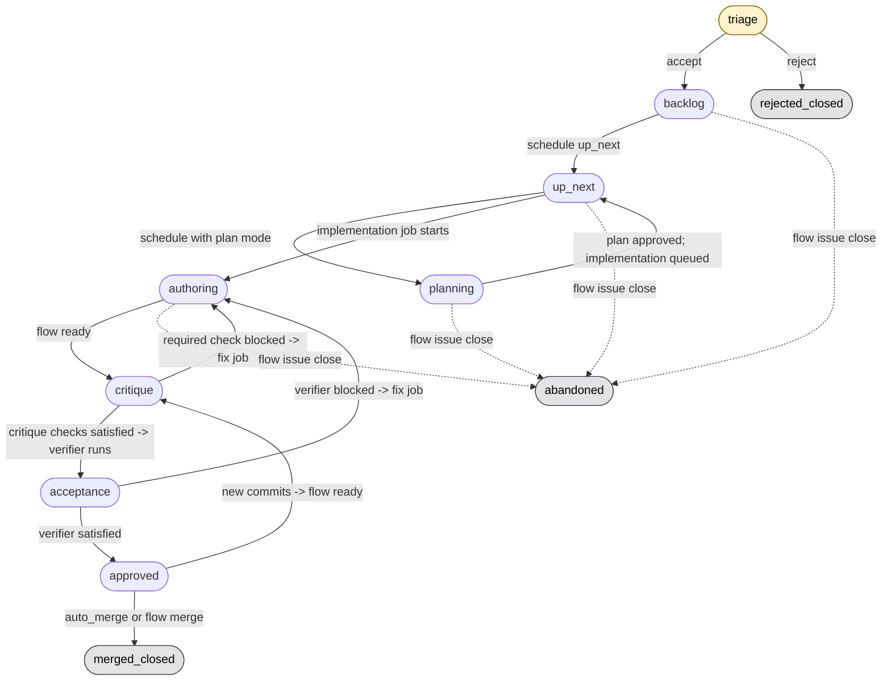

# Usage

This guide covers the web UI, issue lifecycle, common CLI commands, check
configuration, routes, transcripts, and operational notes.

## Web UI

There is no separate web server to start. `flow-server serve` serves the web app
under `/ui/*` on the same coordinator address.

The web UI setup is:

1. Start `flow-server serve` with an owner token and worker join token.
2. Start `flow-worker` with a worker config and `FLOW_WORKER_JOIN_TOKEN`.
3. Onboard at least one repository with `flow init`.
4. Run `flow ui` from a registered repository, or run
   `flow ui --server URL --token TOKEN`.
5. Open the printed login URL.

`flow ui` creates a short-lived, single-use browser login URL. The browser
exchanges that bootstrap token for an HttpOnly session cookie, so the long-lived
owner token is not placed in JavaScript.

The board shows every project's issues as cards. A topbar project picker appears
when more than one project is registered and filters the board by project.
Because issue ids restart per project, project-scoped issue routes are the
unambiguous deep links.

Use **New Issue** to create work from the browser. The form can select a
project, agent harness, model options, priority, human review, auto merge,
attachments, and whether to queue the issue after creation.

For temporary live verification, avoid rewriting your normal CLI discovery
config by either running the server with `--no-write-client-config`, or by
pointing `--client-config` at a temporary path. The `make web-smoke` target uses
an isolated `XDG_CONFIG_HOME` and `FLOW_DATA_DIR` before running the Chromium
web UI smoke test.

## Issue Lifecycle

An issue advances through explicit phases. Human-created issues enter at
`backlog` and are accepted by default. Agent-discovered issues enter the
`triage` inbox until a human accepts or rejects them. Closed outcomes are
`merged_closed`, `rejected_closed`, or `abandoned`. A `blocked` overlay is shown
on top of the underlying phase whenever the issue has an unresolved blocker.



The review loop runs inside `critique`: critique checks, reviewer agents, and an
optional human reviewer run against the current HEAD. Once they are satisfied,
the verifier audits acceptance criteria before the issue becomes `approved`. A
blocked required check sends the issue back to authoring with a fix job.

Inspect an issue's history with `flow transitions <issue-id>` or the Lifecycle
section of its detail page in the web UI.

Human waits are not lifecycle phases. A planning or authoring session can be
`waiting`, a merge can wait for a button press, and blockers can overlay any
phase. Those cases route to the Needs Attention lane with a wait reason while
preserving the underlying phase.

## Common CLI Commands

Once `flow-server serve` has written `$XDG_CONFIG_HOME/flow/config.yaml`, owner
commands need no `--server` or `--token` flags. Pass `--server` or `--token`
only to override the discovered config.

CLI commands auto-detect their project from the current repo's worktree. Run
them from inside a registered repository, target another project explicitly with
`--project NAME|ID`, or use a qualified ref like `other/i-0001`.

Issues:

```sh
flow issue create --title TITLE
flow issue list
flow issue show ISSUE_ID
flow issue edit --title TITLE ISSUE_ID
flow issue schedule ISSUE_ID backlog|up_next
flow issue state ISSUE_ID triage|backlog|up_next|closed|rejected
flow issue triage ISSUE_ID accepted|rejected
flow issue close ISSUE_ID
```

Board and diagnostics:

```sh
flow board
flow checks ISSUE_ID
flow transitions ISSUE_ID
flow review run ISSUE_ID
flow workers
flow jobs
flow reconcile
```

`flow board` aggregates the lanes of every registered project. Use `--project`
to scope a command to one project when you are not inside its worktree.

`flow review run` schedules a review round for the issue's current ready,
unmerged change. It is useful for backfilling older ready changes that have no
checks yet.

Agent/session workflow, usually run inside a Flow-managed tmux session:

```sh
flow fetch-prompt
flow status "Working on implementation"
flow status --kind blocker "Stuck: API contract is ambiguous"
flow handoff write
git commit -m "feat: implement the change"
flow ready <<'HANDOFF'
# Flow Handoff
...
HANDOFF
flow session event working|waiting
```

`flow status` records a typed progress event on the session's issue. The
`--kind` flag classifies the entry so the coordinator and web UI can tell
routine notes apart from things that need a human. Valid kinds are `note`,
`progress`, `plan`, `blocker`, and `question`.

The author finalize is two natural actions: commit your work with a conventional
commit message, then run `flow ready` with the handoff piped on stdin.
`flow ready` validates the handoff, pushes the branch to the exchange remote,
submits the handoff to the coordinator, claims resolved review threads, uploads
the transcript, and marks the change ready for review. Re-running `flow ready`
is safe. Non-interactive callers can pass `--handoff-file PATH` instead of
piping stdin.

`flow handoff write` is an optional mid-session progress snapshot. It renders
and validates a handoff, echoes it to stdout, and, inside a Flow session, posts
it to the coordinator. The coordinator is the sole handoff store, and the next
session's prompt includes the prior handoff.

Attach to a live author session or worker job:

```sh
flow attach SESSION_ID
flow attach --web SESSION_ID
flow attach --job JOB_ID
```

Review threads:

```sh
flow thread list CHANGE_ID
flow thread reply THREAD_ID BODY
flow thread claim THREAD_ID fixed|not_warranted|superseded
flow thread certify THREAD_ID
flow thread reopen THREAD_ID
```

Merge:

```sh
flow merge ISSUE_ID
flow merge CHANGE_ID
```

## Check Configuration

Repo-versioned check configuration lives in `.flow/checks/*.yaml`. CI jobs use
ephemeral capacity. Reviewer and verifier jobs use persistent agent capacity and
therefore need a worker with the selected harness label, such as
`agent.harness.codex: "true"`, and available `persistent_agent` capacity.

If a ready change has no configured reviewer check, Flow creates a required
default `reviewer` check that uses the bundled reviewer instructions through
`flow fetch-prompt` with the issue's selected agent harness. If no verifier
check is configured, Flow creates a required default `verifier` check in the
acceptance phase.

Defining any check with `kind: reviewer` or `kind: verifier` replaces the
corresponding default and can choose a different harness in its entrypoint and
`requires` labels.

Example CI check:

```yaml
name: unit
kind: ci
phase: critique
required: true
entrypoint:
  argv: ["go", "test", "./..."]
  cwd: "."
requires: []
```

Example reviewer check:

```yaml
name: reviewer
kind: reviewer
phase: critique
entrypoint:
  argv: ['codex exec -c "projects.$PWD.trust_level=trusted" "$(flow fetch-prompt)"']
  cwd: "."
  shell: true
requires: ["agent.harness.codex"]
```

Verifier Codex checks use the same prompt command and derive `$flow-verifier`
from `FLOW_WORKER_ROLE=verifier`.

`flow-worker` sets `FLOW_WORKER_HARNESS` from the entrypoint command. Use
`flow fetch-prompt --harness claude|harness|agents` only when overriding that
automatic selection.

Bare requirements such as `requires: ["agent.harness.codex"]` mean
`agent.harness.codex=true` and match worker labels by exact key/value.

## Web UI Routes

The coordinator serves a dependency-light web app under `/ui/*`:

- `/ui/board`
- `/ui/triage`
- `/ui/feedback`
- `/ui/merge`
- `/ui/projects/<project-id>/issues/<issue-id>`
- `/ui/changes/<change-id>`
- `/ui/workers`
- `/ui/jobs`
- `/ui/sessions/<session-id>/terminal`

The board shows every project's issues as cards. Each card links to the
project-scoped `/ui/projects/<project-id>/issues/<issue-id>` route. A topbar
project picker filters the board by project and persists the selection in the
browser.

## Transcripts

Workers pipe each tmux session's pane output to a transcript log and, when a job
finishes, upload its last 10MB to the coordinator. The coordinator stores it
under `$FLOW_DATA_DIR/projects/<project-id>/transcripts/<id>.log` and records
the path on the owning session or job.

The issue-detail session block and `/ui/jobs` page show a Transcript link
whenever a stored transcript exists. Clicking it loads the captured output
inline.

The underlying API routes are:

- `PUT /v1/sessions/<session-id>/transcript`: author sessions upload with the
  session token or owner token; `GET` returns `text/plain` with owner scope.
- `PUT /v1/jobs/<job-id>/transcript?lease_id=<lease-id>`: check jobs upload
  with the worker token and a live lease; `GET` returns `text/plain` with owner
  scope.

A failed upload is logged to the job's stdout and never fails the job.

## Notes

- Flow is designed for local/private coordination. The exchange remote is
  private application state.
- The CLI remains the fallback for every core action.
- Terminal attach requires a running author session or worker job. Browser
  attach also needs a reachable ttyd target from the worker.
- Direct protected-base pushes are rejected by Flow exchange hooks; merge
  through Flow after checks/review pass.
