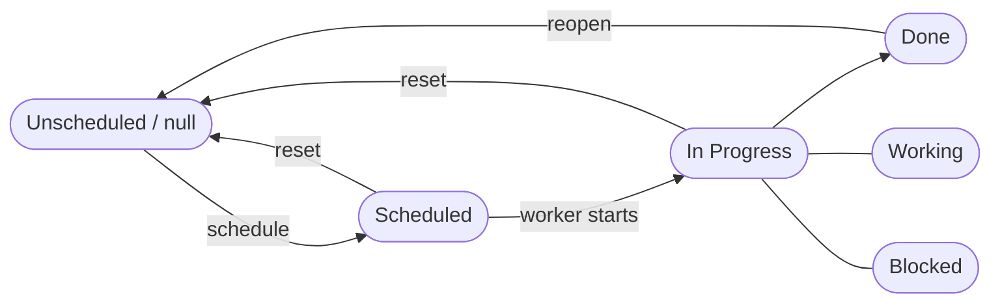

# Usage

This guide covers the web UI, task lifecycle, common CLI commands, check
configuration, routes, transcripts, and operational notes.

## Web UI

There is no separate web server to start. `flow-server serve` serves the web app
under `/ui/*` on the same coordinator address.

The web UI setup is:

1. Start `flow-server serve` with an owner token and worker join token.
2. Start `flow-worker` with a worker config and `FLOW_WORKER_JOIN_TOKEN`.
3. Onboard at least one repository with `flow init`.
4. Run `flow ui` from a registered repository, or run
   `flow ui --server URL --token TOKEN`.
5. Open the printed login URL.

`flow ui` creates a short-lived, single-use browser login URL. The browser
exchanges that bootstrap token for an HttpOnly session cookie, so the long-lived
owner token is not placed in JavaScript.

The board shows every project's tasks as cards. A topbar project picker appears
when more than one project is registered and filters the board by project.
Because task ids restart per project, project-scoped task routes are the
unambiguous deep links.

Use **New Task** to create unscheduled work from the browser. The form can
select a project, workflow, priority, attachments, and whether to schedule the
task after creation. Use the **Flows** page to configure trusted workflow
nodes, transitions, agents, start nodes, and transition budgets.

For temporary live verification, avoid rewriting your normal CLI discovery
config by either running the server with `--no-write-client-config`, or by
pointing `--client-config` at a temporary path. The `make web-smoke` target uses
an isolated `XDG_CONFIG_HOME` and `FLOW_DATA_DIR` before running the Chromium
web UI smoke test.

## Task Lifecycle

Tasks have four user-facing lifecycle states:


```mermaid
flowchart LR
    unscheduled([Unscheduled / null]) -->|schedule| scheduled([Scheduled])
    scheduled -->|worker starts| progress([In Progress])
    progress --> done([Done])
    progress --- working([Working])
    progress --- blocked([Blocked])
    scheduled -->|reset| unscheduled
    progress -->|reset| unscheduled
    done -->|reopen| unscheduled
```

New tasks have no persisted lifecycle state and appear as **Unscheduled**.
**Scheduled** means queued for the selected workflow; unresolved blocker tasks
hold execution at the dependency gate. **In Progress / Working** means the
workflow can act. **In Progress / Blocked** means a human gate or safety budget
requires owner action. **Done** carries a fixed resolution: `completed`,
`merged`, `rejected`, `abandoned`, `cancelled`, or `failed`.

The work inside In Progress is a frozen directed graph. It may branch and loop,
but has one active node at a time. Human gates expose their configured outcomes
on task detail. Reset cancels the active run and preserves its history; reopen
starts a new Unscheduled run, including after a merge.

Inspect the active run and its node history with `flow task workflow TASK_ID`.

## Common CLI Commands

Once `flow-server serve` has written `$XDG_CONFIG_HOME/flow/config.yaml`, owner
commands need no `--server` or `--token` flags. Pass `--server` or `--token`
only to override the discovered config.

CLI commands auto-detect their project from the current repo's worktree. Run
them from inside a registered repository, target another project explicitly with
`--project NAME|ID`, or use a qualified ref like `other/i-0001`.

Tasks:

```sh
flow task create --title TITLE [--flow FLOW]
flow task list
flow task show TASK_ID
flow task edit --title TITLE TASK_ID
flow task schedule TASK_ID
flow task workflow TASK_ID
flow task respond TASK_ID --node-run NODE_RUN_ID --outcome OUTCOME --feedback "..."
flow task reset TASK_ID
flow task done TASK_ID --resolution completed
flow task reopen TASK_ID
```

Board and diagnostics:

```sh
flow board
flow checks TASK_ID
flow transitions TASK_ID
flow workers
flow jobs
flow reconcile
```

Flow configuration:

```sh
flow agent-defs list
flow agent-defs create -f agent.yaml
flow agent-defs edit AGENT_DEF_ID -f agent.yaml
flow flows list
flow flows create -f flow.yaml
flow flows edit FLOW_ID -f flow.yaml
flow flows set-default FLOW_ID
```

`flow board` aggregates the lanes of every registered project. Use `--project`
to scope a command to one project when you are not inside its worktree.

`flow agent-defs` and `flow flows` manage the same project-owned configuration
shown in the web UI's **Flows** page. The `-f` files can be YAML or JSON; use
`-f -` to read from stdin.

Agent/session workflow, usually run inside a Flow-managed tmux session:

```sh
flow fetch-prompt
flow status "Working on implementation"
flow status --kind blocker "Stuck: API contract is ambiguous"
git commit -m "feat: implement the change"
flow complete --summary-file SUMMARY.md
flow session event working|waiting
```

`flow status` records a typed progress event on the session's task. The
`--kind` flag classifies the entry so the coordinator and web UI can tell
routine notes apart from things that need a human. Valid kinds are `note`,
`progress`, `plan`, `blocker`, and `question`.

`flow complete` validates the active node contract and submits its typed
artifact. For a change node it resolves and pushes the run-specific branch and
pins the artifact to HEAD. Task-planning nodes also pass
`--output-file TASK_SET.json`; handoff nodes need only the Markdown summary.
The command is idempotent for the active node run.

Attach to a live author session or worker job:

```sh
flow attach SESSION_ID
flow attach --web SESSION_ID
flow attach --job JOB_ID
```

Review threads:

```sh
flow thread list CHANGE_ID
flow thread reply THREAD_ID BODY
flow thread claim THREAD_ID fixed|not_warranted|superseded
flow thread certify THREAD_ID
flow thread reopen THREAD_ID
```

## Check Configuration

Repo-versioned CI configuration lives in `.flow/checks/*.yaml`. CI jobs use
ephemeral capacity. Review and verification agents are selected by their graph
nodes and use persistent agent capacity, so workers need the selected agent's
harness label, such as `agent.harness.codex: "true"`.

An `automated_checks` node runs the repository CI definitions. A
`change_review` or `verify_change` node runs the agent definitions frozen into
that graph node. Each node visit receives distinct check identities, so a loop
back through review or verification executes them again.

Set `requires` labels on CI definitions to match workers that can run the
entrypoint. Review and verifier instructions belong in agent definitions, not
repository check configuration.

Example CI check:

```yaml
name: unit
kind: ci
required: true
entrypoint:
  argv: ["go", "test", "./..."]
  cwd: "."
requires: []
```

`flow-worker` sets `FLOW_WORKER_HARNESS` from an agent job's entrypoint. Use
`flow fetch-prompt --harness claude|harness|agents` only when overriding that
automatic selection.

Bare requirements such as `requires: ["agent.harness.codex"]` mean
`agent.harness.codex=true` and match worker labels by exact key/value.

## Web UI Routes

The coordinator serves a dependency-light web app under `/ui/*`:

- `/ui/board`
- `/ui/projects/<project-id>/tasks/<task-id>`
- `/ui/changes/<change-id>`
- `/ui/console`
- `/ui/flows`
- `/ui/workers`
- `/ui/jobs`
- `/ui/done`
- `/ui/sessions/<session-id>/terminal`

The board shows every project's tasks as cards. Each card links to the
project-scoped `/ui/projects/<project-id>/tasks/<task-id>` route. A topbar
project picker filters the board by project and persists the selection in the
browser.

## Transcripts

Workers pipe each tmux session's pane output to a transcript log and, when a job
finishes, upload its last 10MB to the coordinator. The coordinator stores it
under `$FLOW_DATA_DIR/projects/<project-id>/transcripts/<id>.log` and records
the path on the owning session or job.

The task-detail session block and `/ui/jobs` page show a Transcript link
whenever a stored transcript exists. Clicking it loads the captured output
inline.

The underlying API routes are:

- `PUT /v2/sessions/<session-id>/transcript`: author sessions upload with the
  session token or owner token; `GET` returns `text/plain` with owner scope.
- `PUT /v2/jobs/<job-id>/transcript?lease_id=<lease-id>`: check jobs upload
  with the worker token and a live lease; `GET` returns `text/plain` with owner
  scope.

A failed upload is logged to the job's stdout and never fails the job.

## Notes

- Flow is designed for local/private coordination. The exchange remote is
  private application state.
- The CLI remains the fallback for every core action.
- Terminal attach requires a running author session or worker job. Browser
  attach also needs a reachable ttyd target from the worker.
- Direct protected-base pushes are rejected by Flow exchange hooks; merge
  through Flow after checks/review pass.
