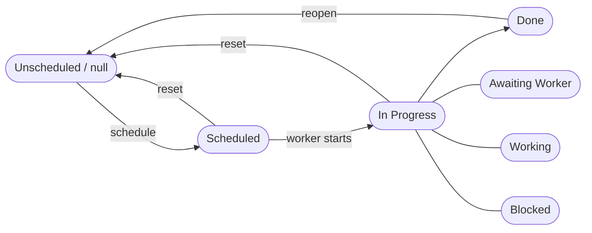

# Usage

This guide covers the web UI, task lifecycle, common CLI commands, check
configuration, routes, transcripts, and operational notes.

## Web UI

There is no separate web server to start. `flow-server serve` serves the web app
under `/ui/*` on the same coordinator address.

The web UI setup is:

1. Start `flow-server serve` with owner and orchestrator tokens.
2. Start `flow-orchestrator` with a Kubernetes or Darwin assignment profile. It
   creates one one-shot worker runtime for each reserved job.
3. Onboard at least one repository with `flow init`.
4. Run `flow ui` from a registered repository, or run
   `flow ui --server URL --token TOKEN`.
5. Open the printed login URL.

`flow ui` creates a short-lived, single-use browser login URL. The browser
exchanges that bootstrap token for an HttpOnly session cookie, so the long-lived
owner token is not placed in JavaScript.

The board shows every project's live tasks as cards in three lanes:
**Scheduled** (queued for its first worker job), **Working** (actively
executing — including tasks whose worker job is queued or claimed but not yet
running, labeled **awaiting worker** so a stalled dispatch is visible at a
glance), and **Waiting** (idle: parked at a human gate or in review, held, or
blocked). A throughput strip above the lanes tallies successful completions in
cumulative windows from 15m up to 24h; closed work lives in the Tasks view's
Done filter (`/ui/tasks?state=done`) and on the Done page (`/ui/done`), which
lists every closed task with its outcome and merged change. A sticky top bar
frames every
page: primary navigation lives in the dropdown on the left, whose trigger
shows the current page label alongside compact board lane chips (scheduled,
in progress, blocked). The panel lists every destination — Board, Tasks,
Console, Done, Flows, Workers, Jobs — with live per-destination badges such as
the unscheduled-task count, closed-task count, assignment-worker status, and active and queued jobs, plus the
theme switcher at the bottom. A project picker appears at the right edge of
the bar when more than one project is registered and filters the board by
project. Task IDs embed their normalized project key, so links such as
`/ui/tasks/t-flow-app-0001` remain unambiguous across every registered project.

The **Tasks** page is a flat, filterable list of every task across the visible
projects — including unscheduled work, which no longer has a board lane.
Lifecycle-state chips (All, Unscheduled, Scheduled, In Progress, Done) narrow
the list; the four state chips combine, so several states can be shown at
once, and All selects or clears all four in one click. An in-view project
dropdown (composing with the topbar project picker) and a title/body text
search narrow the list further. Row checkboxes (plus select-all)
enable bulk edits that fan out over the selected tasks: set priority, set
flow, schedule, reset to unscheduled, and retry a failed workflow.

Use **New Task** to create unscheduled work from the browser. The form can
select a project, workflow, priority, attachments, and whether to schedule the
task after creation. Use the **Flows** page to configure trusted workflow
nodes, transitions, agents, start nodes, and transition budgets.

For temporary live verification, avoid rewriting your normal CLI discovery
config by either running the server with `--no-write-client-config`, or by
pointing `--client-config` at a temporary path. The `make web-smoke` target uses
an isolated `XDG_CONFIG_HOME` and `FLOW_DATA_DIR` before running the Chromium
web UI smoke test.

## Task Lifecycle

Tasks have four user-facing lifecycle states:


```mermaid
flowchart LR
    unscheduled([Unscheduled / null]) -->|schedule| scheduled([Scheduled])
    scheduled -->|worker starts| progress([In Progress])
    progress --> done([Done])
    progress --- awaiting([Awaiting Worker])
    progress --- working([Working])
    progress --- blocked([Blocked])
    scheduled -->|reset| unscheduled
    progress -->|reset| unscheduled
    done -->|reopen| unscheduled
```

New tasks have no persisted lifecycle state and appear as **Unscheduled**.
**Scheduled** means the workflow run has not started yet: the task is queued
for its first worker job, and unresolved blocker tasks hold execution at the
dependency gate. **In Progress / Awaiting worker** (the derived `awaiting_worker`
lane state) means the active workflow node has a live job that is queued or
claimed but not yet running. **In Progress / Working** means a job is running
or the node is executing synchronously. **In Progress / Blocked** means a human
gate or safety budget requires owner action. **Done** carries a fixed
resolution: `completed`, `merged`, `rejected`, `abandoned`, `cancelled`, or
`failed`.

The work inside In Progress is a frozen directed graph. It may branch and loop,
but has one active node at a time. Human gates expose their configured outcomes
on task detail. Reset cancels the active run and preserves its history; reopen
starts a new Unscheduled run, including after a merge.

Inspect the active run and its node history with `flow task workflow TASK_ID`.

## Common CLI Commands

Once `flow-server serve` has written `$XDG_CONFIG_HOME/flow/config.yaml`, owner
commands need no `--server` or `--token` flags. Pass `--server` or `--token`
only to override the discovered config.

CLI commands auto-detect their project from the current repo's worktree. Run
them from inside a registered repository or target project-owned collection
operations explicitly with `--project NAME|ID`. A full task ID is globally
resolvable, so `flow task show t-flow-app-0001` works from any directory.

Project IDs are derived from the project display name. Flow lowercases ASCII
letters, replaces punctuation and whitespace runs with hyphens, and keeps the
display name unchanged. For example, `flow init --name "Flow App"` creates
project `p-flow-app`, whose first task is `t-flow-app-0001`. Two names that
normalize to the same key are rejected so identifiers remain predictable.

Tasks:

```sh
flow task create --title TITLE [--flow FLOW] [--feature FEATURE]
flow task list
flow task show TASK_ID
flow task edit --title TITLE [--feature FEATURE] TASK_ID
flow task schedule TASK_ID
flow task workflow TASK_ID
flow task respond TASK_ID --node-run NODE_RUN_ID --outcome OUTCOME --feedback "..."
flow task retry [--refresh-agent-runtime] TASK_ID
flow task budget TASK_ID --additional N
flow task reset TASK_ID
flow task done TASK_ID --resolution completed
flow task reopen TASK_ID
```

Features (project-child task groups with their own exchange branch):

```sh
flow feature create --title TITLE [--body BODY]
flow feature list [--status open|landed|archived|all]
flow feature show FEATURE_ID
flow feature edit --title TITLE FEATURE_ID
flow feature rebase FEATURE_ID
flow feature land FEATURE_ID
flow feature archive FEATURE_ID
```

A feature groups a set of tasks behind one long-lived `feature/f-...` branch.
Tasks assigned to a feature (`flow task create --feature`, the web task form's
feature picker) branch off the feature branch and merge back into it instead of
the base branch. `flow feature rebase` rebases the feature branch onto the base
branch — instantly when the merge is clean, otherwise by creating a rebase task
whose agent resolves the conflicts and whose verification gates a
compare-and-swap update of the shared branch. A running rebase blocks the
feature's other tasks via ordinary `blocks` relations. `flow feature land`
squash-merges the feature branch into the base branch; archive is the only
delete and retains the branch for audit.

Board and diagnostics:

```sh
flow board
flow checks TASK_ID
flow transitions TASK_ID
flow workers
flow jobs
flow reconcile
```

Flow configuration:

```sh
flow agent-defs list
flow agent-defs create -f agent.yaml
flow agent-defs edit -f agent.yaml AGENT_DEF_ID
flow agent-defs rm AGENT_DEF_ID
flow agent-defs list --global
flow agent-defs create --global -f agent.yaml
flow agent-defs edit --global -f agent.yaml AGENT_DEF_ID
flow agent-defs rm --global AGENT_DEF_ID
flow flows list
flow flows create -f flow.yaml
flow flows edit FLOW_ID -f flow.yaml
flow flows rm FLOW_ID
flow flows set-default FLOW_ID
```

`flow board` aggregates the lanes of every registered project. Use `--project`
to scope a command to one project when you are not inside its worktree.
In-progress tasks whose active workflow node has a queued or claimed worker job
are annotated `[awaiting worker]`, distinguishing them from tasks that are
actively working (which carry no annotation).

`flow agent-defs` and `flow flows` manage the same configuration shown in the
web UI's **Flows** page. Agent definitions are project-scoped by default; pass
`--global` to manage the coordinator-wide catalog inherited by every project.
The `-f` files can be YAML or JSON; use `-f -` to read from stdin. `flow flows
list` prints each graph's start key and node count, followed by its
blocking/advisory reviewer and verifier counts.

An agent definition combines two concerns: the **model agent** selection
(`harness`, optional `model`, and optional `reasoning_effort`) and the **focus
agent** instructions (`name` and `prompt`) applied to that model. The
`flow agent-defs list|create|edit|rm` commands manage these reusable
model/focus definitions; graph nodes reference their IDs. A project's effective
catalog merges its local rows with the global catalog by name. A local row wins
when names match. Editing an inherited row through the project command creates
that same-name local override; editing with `--global` changes the definition
for every project that has not overridden it. Global definitions referenced by
any project flow cannot be deleted.

For example, create two definitions with distinct models and review focuses:

```yaml
# security-review.yaml
name: security-review
harness: harness
model: openai:gpt-5.2
reasoning_effort: high
prompt: Review authorization boundaries, input trust, and secret handling. Report concrete exploitable paths.
```

```yaml
# performance-review.yaml
name: performance-review
harness: harness
model: anthropic:claude-opus-4-8
reasoning_effort: high
prompt: Review algorithmic cost, database access patterns, allocation hot spots, and realistic scaling risks.
```

```sh
flow agent-defs create -f security-review.yaml
flow agent-defs create -f performance-review.yaml
flow agent-defs list
```

Use the IDs returned by those commands in a review node (shown here as the
relevant node from a flow file):

```yaml
key: review
name: Security and performance review
kind: change_review
config:
  change_review:
    agents:
      - agent_def_id: ad-security-review
        blocking: true
      - agent_def_id: ad-performance-review
        blocking: false
    aggregator_agent_def_id: ad-review-aggregator
```

A flow may reference an inherited global ID. At scheduling time Flow resolves a
same-name project override, if present, then freezes the selected model and
focus prompt. Editing a live global or project definition therefore affects
only later workflow runs.

Agent/session workflow, usually run inside a Flow-managed tmux session:

```sh
flow fetch-prompt
flow status "Working on implementation"
flow status --kind blocker "Stuck: API contract is ambiguous"
git commit -m "feat: implement the change"
mkdir -p .flow/session
flow complete --summary-file .flow/session/SUMMARY.md
flow session event working|waiting
```

`flow status` records a typed progress event on the session's task. The
`--kind` flag classifies the entry so the coordinator and web UI can tell
routine notes apart from things that need a human. Valid kinds are `note`,
`progress`, `plan`, `blocker`, and `question`.

`flow complete` validates the active node contract and submits its typed
artifact. For a change node it resolves and pushes the run-specific branch and
pins the artifact to HEAD. Task-planning nodes also pass
`--output-file .flow/session/TASK_SET.json`; handoff nodes need only the Markdown
summary. Flow-generated summaries and manifests belong under `.flow/session/`,
which worker worktrees add to `.git/info/exclude`, omit from review diffs, and
protect from landing on the base branch. Squash merges also reject newly added
files matched by the repository's
committed `.gitignore`, so project-specific generated state cannot be landed by
an older task branch. The command is idempotent for the active node run.

Flow-owned reviewer, discovery, aggregation, and verifier jobs use the same
command without flags. They run as interactive check terminals: write the
structured verdict to `$FLOW_VERDICT_FILE`, then run `flow complete`. The
command validates the role-specific verdict schema and seals its exact bytes;
the worker closes the terminal and reports the captured result only after that
seal is valid. A validation error is printed in the live terminal so the agent
or an operator can correct the verdict and retry without starting another
agent run. Repository-owned custom checks retain their configured process-exit
behavior and do not require `flow complete`.

Attach to a live author session or worker job:

```sh
flow attach SESSION_ID
flow attach --web SESSION_ID
flow attach --job JOB_ID
```

Review threads:

```sh
flow thread list CHANGE_ID
flow thread reply THREAD_ID BODY
flow thread claim THREAD_ID fixed|not_warranted|superseded
flow thread certify THREAD_ID
flow thread reopen THREAD_ID
```

## Multi-Agent Nodes and Check Configuration

Repo-versioned CI configuration lives in `.flow/checks/*.yaml`. CI jobs use the
`ephemeral` workload bucket. Review and verification agents are selected by
their graph nodes and use the `persistent_agent` bucket. Orchestrator profiles
must accept the needed buckets; agent jobs assume the Harness executable is
available on those workers. Bucket names classify jobs; every selected job still
gets its own one-shot worker process.

An `automated_checks` node runs the repository CI definitions. A
`change_review` or `verify_change` node is a multi-agent node: it fans out one
child job per configured focus agent while remaining the workflow run's one
active graph node. Successor graph nodes cannot start until that internal
barrier closes.

The barrier awaits every child, including advisory agents. In a
`change_review` node, configured reviewers are parallel discovery inputs: they
cannot create review threads directly. Once they all report, Flow runs one
aggregation job using the agent definition selected by
`aggregator_agent_def_id`. Its independently editable runtime and prompt control
the synthesis pass. The aggregate deduplicates the candidate reports and is the
only reviewer result that can create blocking threads or select
`changes_requested`; whether it may block is derived from the discovery agents'
blocking settings.

Agent entries are blocking inputs by default when the flag is omitted. A
finding from an advisory input is recorded and shown but cannot become a
blocking aggregate finding. Use `blocking: false` for an advisory entry. It
does not skip or detach the job: the agent is always dispatched and the
barrier still waits for its terminal result. The older `required` spelling is
a deprecated compatibility alias (`required: true` means blocking and
`required: false` means advisory); new flow files should use `blocking` and
should not set both names.

Each node visit receives distinct check identities, so a loop back through
review or verification executes every configured child again. All of those
children use the `persistent_agent` workload bucket with author and other agent
jobs; the barrier can therefore wait until the orchestrator can reserve and
launch another assignment.

Set `requires` labels on CI definitions to match workers that can run the
entrypoint. Review and verifier instructions belong in agent definitions, not
repository check configuration.

Example CI check:

```yaml
name: unit
kind: ci
required: true
entrypoint:
  argv: ["go", "test", "./..."]
  cwd: "."
requires: []
```

`flow-worker` sets `FLOW_WORKER_HARNESS` from an agent job's entrypoint. Use
`flow fetch-prompt --harness harness|agents` only when overriding that
automatic selection.

## Web UI Routes

The coordinator serves a dependency-light web app under `/ui/*`:

- `/ui/board`
- `/ui/projects/<project-id>/tasks/<task-id>`
- `/ui/features`
- `/ui/projects/<project-id>/features/<feature-id>`
- `/ui/changes/<change-id>`
- `/ui/console`
- `/ui/flows`
- `/ui/workers`
- `/ui/jobs`
- `/ui/done`
- `/ui/sessions/<session-id>/terminal`

The board shows every project's tasks as cards. Each card links to the
project-scoped `/ui/projects/<project-id>/tasks/<task-id>` route. A topbar
project picker filters the board by project and persists the selection in the
browser.

## Transcripts

Workers pipe each tmux session's pane output to a transcript log and, when a job
finishes, upload its last 10MB to the coordinator. The coordinator stores it
under `$FLOW_DATA_DIR/projects/<project-id>/transcripts/<id>.log` and records
the path on the owning session or job.

The task-detail session block and `/ui/jobs` page show a Transcript link
whenever a stored transcript exists. Clicking it loads the captured output
inline.

The underlying API routes are:

- `PUT /v2/sessions/<session-id>/transcript`: author sessions upload with the
  session token or owner token; `GET` returns `text/plain` with owner scope.
- `PUT /v2/jobs/<job-id>/transcript?lease_id=<lease-id>`: check jobs upload
  with the worker token and a live lease; `GET` returns `text/plain` with owner
  scope.

A failed upload is logged to the job's stdout and never fails the job.

## Assignment operations

Assignment workers are backed by coordinator-owned records in each job's project
database. The orchestrator recovers all existing assignments before it reserves
new work, then creates exactly one Kubernetes Job plus private Secret or one
Darwin child for each new assignment. That runtime executes `flow-worker run
--one-shot --config PATH` with a short-lived assignment-worker credential,
exact-claims the reserved job, reports its outcome, and exits.

Concurrency comes from independent durable assignments, bounded by the
orchestrator profile's `max_concurrency`. Worker selection belongs to the
profile; generated worker configs are private to one assignment.

After an orchestrator restart, preserve and reuse profile names, provider IDs,
Kubernetes namespaces, and Darwin state directories. Readiness stays false until
a complete recovery-first cycle succeeds. Closed assignments remain pending
cleanup until their provider resource is deleted, worker credentials are
revoked, the worker-directory row is removed, and cleanup is recorded. Claimed
work remains governed by lease expiry and job recovery even if its provider
resource disappears.

All binary telemetry endpoints (`/readyz`, `/livez`, and `/metrics`) are
unauthenticated. Keep them loopback-only by default or cluster-internal in
Kubernetes; never expose them through a public Ingress or LoadBalancer.

## Notes

- Flow is designed for local/private coordination. The exchange remote is
  private application state.
- The CLI remains the fallback for every core action.
- Terminal attach requires a running author session or worker job. The worker
  streams terminal data to the coordinator over its control WebSocket, so no
  worker-side listener or inbound reachability is required.
- Direct protected-base pushes are rejected by Flow exchange hooks; merge
  through Flow after checks/review pass.
